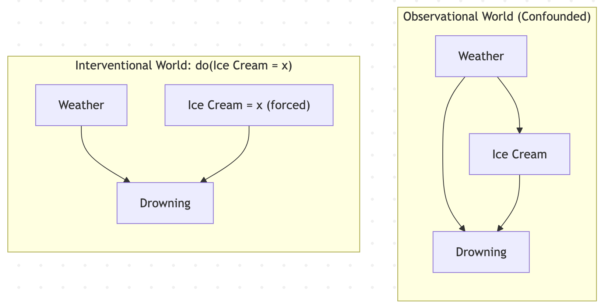

# Causal Inference Deep Dive

## Pearl’s Do-Calculus: The Mathematical Foundation

To understand causal inference, you must separate **observational data** (_what is_) from **interventional data** (_what if_).
Traditional statistics and machine learning operate on observational probabilities like $\(P(Y \mid X)\)$, which reads: "What is the probability of outcome Y given that I observe treatment X?" This is prone to confounding. For example, ice cream sales and drowning rates are correlated because hot weather causes both.Judea Pearl introduced the do(⋅) operator to denote an active intervention. \(P(Y \mid do(X = x))\) reads: "What is the probability of Y if I physically step into the world and force X to take the value x?"

