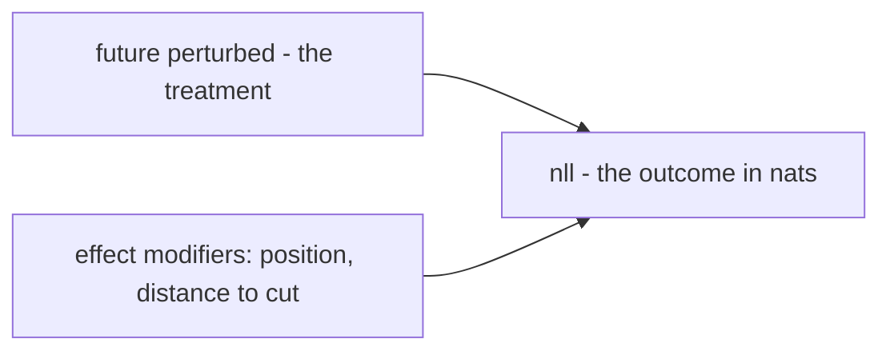
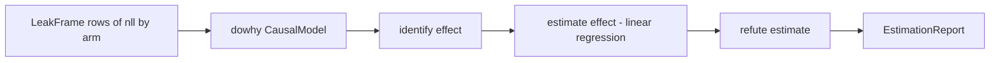
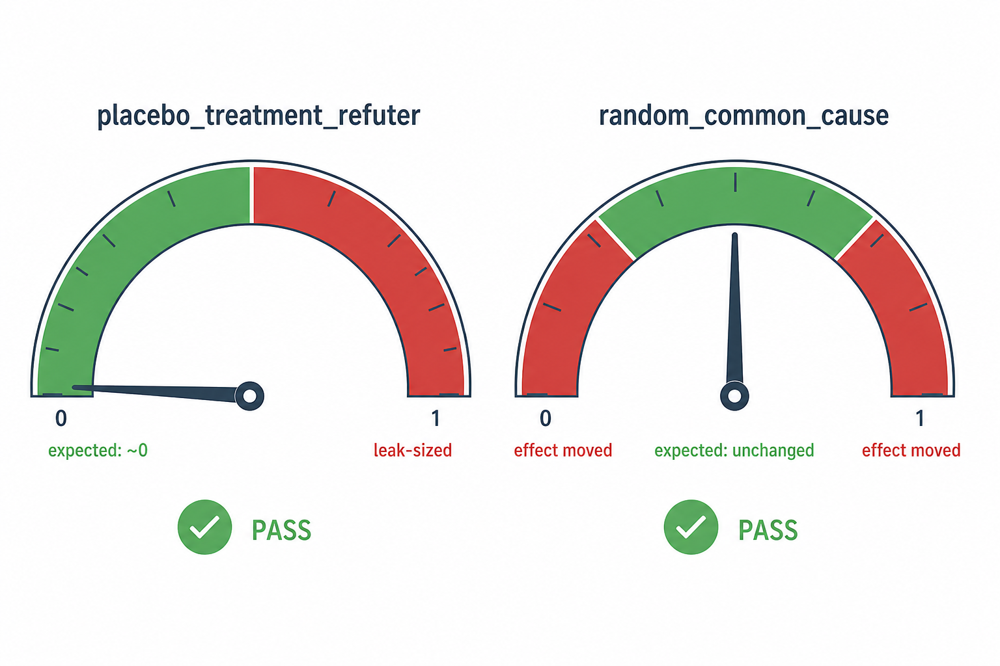
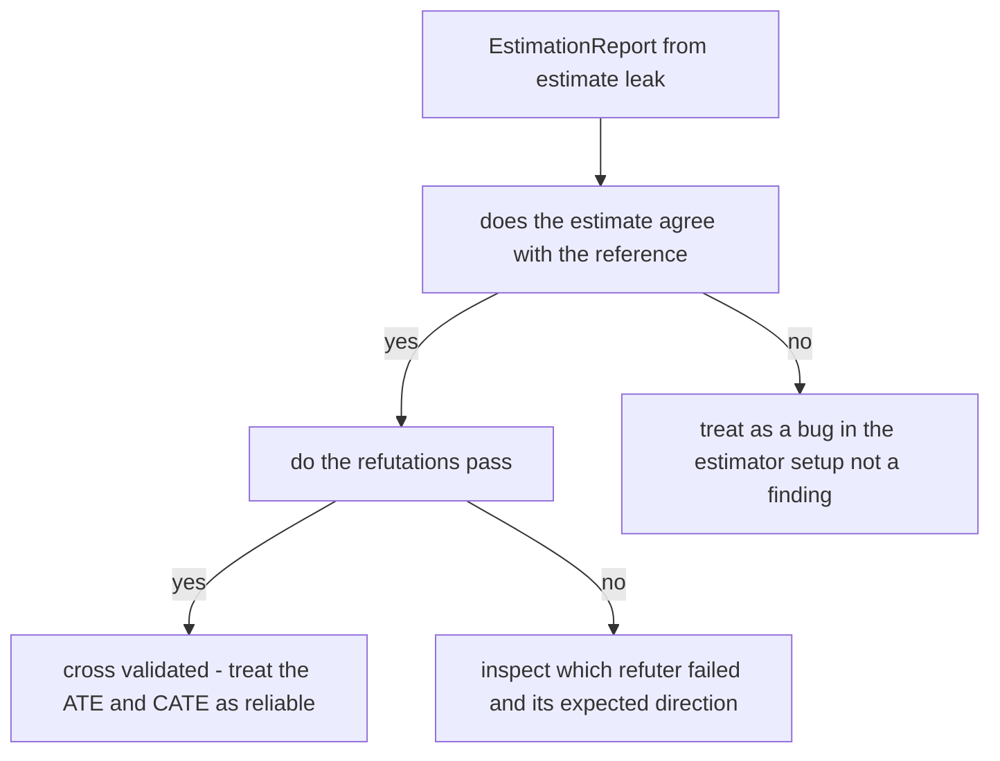

# DoWhy for Refutation in SCAF: A Deep Dive

Companion to the README section [Formal estimands: DoWhy, EconML, refutation](../README.md#formal-estimands-dowhy-econml-refutation)
and to [`docs/Framework_for_Causal_Analysis_SemSimula_Models.md`](Framework_for_Causal_Analysis_SemSimula_Models.md).
Every number below is either computed live from SCAF's own code in this
repository, or quoted verbatim from the README's published audit of a real
Fock-PARFLM checkpoint. Nothing here is invented.

**Status:** the DoWhy/EconML bridge lives in `src/scaf/estimate/pywhy.py` and
`src/scaf/estimate/frames.py`, is optional (`pip install "semsimula-scaf[pywhy]"`),
and never touches the core probe battery or `LeakMonitor`.

---

## 1. The one sentence that decides everything

SCAF assigns the treatment itself. The auditor decides, for each row, whether
the future was left alone or replaced by `do(future := resampled)`. Nothing in
the model, the corpus, or the world causes that decision, so no arrow points
into the treatment, and DoWhy's headline capability — deciding whether an
effect is estimable despite confounding — has nothing to identify. The paired
difference already is the causal effect.

That single fact reorganizes what the rest of this document is about. DoWhy
is imported for three things only, and identification is not one of them:

1. **Refutation** — `placebo_treatment_refuter` and `random_common_cause`, a
   standardized, citable robustness suite instead of hand-rolled scripts.
2. **Heterogeneity** — an EconML CATE fit alongside SCAF's own exact
   stratified profile, answering *which* positions leak.
3. **An independent cross-check** — an estimator that has no freedom to
   disagree with the paired difference, so agreement is itself evidence the
   frame was built correctly.

This document is about item 1. Sections 4 and 5 also cover item 3, because the
cross-check is the reason the refutation numbers are trustworthy in the first
place.

### 1.1 The graph SCAF hands to DoWhy

`LeakFrame.to_dot()` builds the causal graph exactly once, and the property
that matters is what it leaves out:



No node points into `Treat`. A confounder edge would assert that something —
topic, syntax, position — causes whether the future was resampled, and that
would be false: resampling is a coin flip the auditor made, not a property of
the text. Writing that missing edge is the entire identification step; DoWhy's
`identify_effect` returns instantly because the backdoor set is empty by
construction.

The average treatment effect this graph identifies is

$$
\text{ATE} = \mathbb{E}\Big[ \text{NLL}\big(x, \text{do}(x_{\gt t_p} := \tilde x_{\gt t_p})\big) - \text{NLL}(x) \Big],
$$

the expected change in next-token negative log-likelihood when the future
after cut position $t_p$ is replaced by a resampled continuation $\tilde x$,
holding the scored target fixed. A structurally causal model has
$\text{ATE} = 0$ for every choice of $t_p$; a leak reports a value in nats
directly comparable to the honest-versus-standard perplexity gap.

---

## 2. The pipeline, end to end



Each stage is a direct call in `scaf.estimate.pywhy.estimate_leak`:

```python
# src/scaf/estimate/pywhy.py (trimmed)
from dowhy import CausalModel

model = CausalModel(
    data=df,
    treatment=frame.treatment,      # "future_perturbed"
    outcome=outcome,                # "nll" (or the within-pair centred column)
    graph=frame.to_dot(outcome),    # no edge into the treatment
    common_causes=list(frame.common_causes) or None,   # empty
    effect_modifiers=list(frame.effect_modifiers),
)
estimand = model.identify_effect(proceed_when_unidentifiable=True)

estimate = model.estimate_effect(
    estimand,
    method_name="backdoor.linear_regression",
    control_value=0, treatment_value=1,
)

for name in ("placebo_treatment_refuter", "random_common_cause"):
    report.refutations.append(_run_refuter(model, estimand, estimate, name, ...))
```

`backdoor.linear_regression` with an empty backdoor set is a regression of the
outcome on the treatment alone — no covariates to adjust for, because there is
nothing to adjust for. Section 4.2 derives exactly what that estimator
computes and confirms it against SCAF's own paired arithmetic.

---

## 3. Two refuters, two different jobs

A refutation is a **stress test on the estimator**, not a second measurement
of the effect. Each one has an expected direction, and SCAF encodes that
direction as a semantics tag so the reader does not have to remember which way
is good news:

| Refuter | What it does | Expected direction | Semantics |
| --- | --- | --- | --- |
| `placebo_treatment_refuter` | permutes the treatment column, refits | collapses toward zero | `null` |
| `random_common_cause` | adds an independent random covariate, refits | stays close to the original | `stable` |

<p align="center"></p>

*Figure 1. The two refuters fail in opposite directions. A placebo that stays
large is a false positive waiting to happen; a random-cause addition that
moves the estimate a lot means the estimator is unstable, not that a new
confounder was found — there cannot be one, by construction.*

Both are compared against the original effect through a single tolerance
band, `refute_tol` (default `0.1`, i.e. 10%):

$$
\text{band} = \text{refute\_tol} \times \max\big(|\text{original effect}|, 10^{-9}\big).
$$

`placebo_treatment_refuter` passes when $|\text{new effect}| \le \text{band}$;
`random_common_cause` passes when $|\text{new effect} - \text{original effect}| \le \text{band}$.
The floor of $10^{-9}$ only matters for a truly zero effect, where any band
scaled off the effect itself would be zero and nothing could ever fail it.

### 3.1 Why the placebo permutation is the right stress test

`placebo_treatment_refuter` with `placebo_type="permute"` shuffles the
treatment label across every row, independent of pairing. That is exactly the
operation that should destroy a real effect and exactly the operation a
biased or leaky estimator might fail to be moved by.

<p align="center"></p>

*Figure 2. Why permutation is a placebo. The paired design (left) has every
counterfactual sitting above its matched factual by roughly the same gap —
that consistent gap is the ATE. Scrambling which factual goes with which
counterfactual (right) keeps every individual number on the page but destroys
the pairing that produced the gap, so a correctly behaving estimator must
report an effect near zero.*

---

## 4. Worked example A: a synthetic leak, computed end to end

Every number in this section comes from running SCAF's actual code against
`PeekingToyLM`, the toy model that copies the next token into the current
position — the miniature of the register leak. It reads the causal prefix
*and* peeks at $x_{t+1}$, so it is not a straw man: like the real Fock leak,
it does genuine causal work and leaks in addition.

```python
from scaf.estimate import build_leak_frame
from tests.toy_models import ToyConfig, PeekingToyLM

cfg = ToyConfig(vocab_size=24, d=16, max_len=64)
frame = build_leak_frame(
    PeekingToyLM(cfg, gain=8.0),
    vocab_size=24, seq_len=32, n_seqs=4, n_pairs=2, max_positions=6,
)
```

### 4.1 The frame

`build_leak_frame` produces 288 rows: 144 factual/counterfactual pairs, one
pair per scored `(sequence, split, target position)` combination. A handful of
rows, abbreviated:

| unit_id | future_perturbed | nll | distance_to_cut | target_perturbed |
| --- | --- | --- | --- | --- |
| s0_c16_p0_t16 | 0 | 0.31 | 0 | 1 |
| s0_c16_p0_t16 | 1 | 108.53 | 0 | 1 |
| s0_c16_p0_t14 | 0 | 0.29 | 2 | 0 |
| s0_c16_p0_t14 | 1 | 0.29 | 2 | 0 |

Row 1-2 is a pair at the cut itself (`distance_to_cut = 0`): the target token
is the very first resampled one, so the model's belief about it swings from
near-certain (0.31 nats) to close to a uniform guess over 24 tokens
(108.53 nats — close to $\ln(24) \approx 3.18$ nats would be uninformed
guessing among the true continuations, but here the model actively predicted
the *old* future's token, which the resampled target no longer matches, hence
the larger gap). Row 3-4 is two positions before the cut: perturbing the
future changes nothing there, because this toy's peek reaches exactly one
token ahead and no further.

### 4.2 The paired ATE, and what backdoor.linear_regression computes

SCAF's own exact statistic is a mean over pair differences:

$$
\hat\tau = \frac{1}{n}\sum_{u=1}^{n} \big(y_u^{(1)} - y_u^{(0)}\big), \qquad n = 144.
$$

Computed directly:

```text
ATE (paired)    18.03746766431464
ATE (naive)     18.03746766431464
```

The two agree exactly because the design is balanced — every unit contributes
one row per arm, so the difference of group means and the mean of paired
differences are algebraically the same number.

`backdoor.linear_regression` with no covariates fits

$$
y_i = \beta_0 + \beta_1 d_i + \varepsilon_i, \qquad d_i \in \lbrace 0, 1 \rbrace,
$$

over all 288 rows, and reports $\hat\beta_1$ as the ATE. The closed-form
solution for a single binary regressor is the difference of group means,

$$
\hat\beta_1 = \bar y^{(1)} - \bar y^{(0)},
$$

which is exactly the naive ATE above — and, since the design is balanced, also
exactly the paired one. Refitting that regression directly (the same
least-squares problem `backdoor.linear_regression` solves) gives:

```text
OLS intercept (beta_0)      1.3816052476564928
OLS treatment (beta_1)      18.03746766431464
```

$\hat\beta_1$ matches the paired ATE to full floating-point precision. This is
not a coincidence to admire once and forget: it is the property
`EstimationReport.agrees_with_reference` checks on every run, and a mismatch
is treated as a bug in the estimator configuration, never as a subtler
finding — treatment was randomized, so an unbiased estimator has no room to
disagree.

### 4.3 The exact significance test, and the danger it replaces

Two different things in this stack ask "is this effect real?", and only one
of them should be trusted by default.

**DoWhy's own significance test** (`estimate.test_stat_significance()`,
surfaced through `dowhy_inference=True`) permutes the treatment column across
the *pooled* frame and asks how often a random permutation produces an effect
this large. That throws away the pairing. On a real leaky checkpoint this
returned a p-value of 0.69 for an effect whose own confidence interval was
nowhere near zero — a false all-clear, which is precisely the failure mode
this whole library exists to prevent. It is off by default for exactly this
reason.

**SCAF's own sign-flip test** (`LeakFrame.ate_test`) respects the pairing.
Under the null that the future cannot reach the past, the two arms of a pair
are exchangeable, so flipping the sign of any pair's difference $d_u$ — the
factual outcome $y_u^{(0)}$ subtracted from its counterfactual match
$y_u^{(1)}$ — leaves its null distribution unchanged. Drawing $P$ random sign
vectors $\mathbf{s}^{(k)} \in \lbrace -1, +1 \rbrace^n$ and forming

$$
\bar d_k = \frac{1}{n}\sum_{u=1}^{n} s_u^{(k)} d_u
$$

gives an exact reference distribution, and the p-value is

$$
\hat p = \frac{1 + \sum_{k=1}^{P} \mathbb{1}\left[|\bar d_k| \ge |\bar d|\right]}{1 + P}.
$$

Run with $P = 2000$ sign draws and a paired bootstrap for the interval:

```text
ATE               18.03746766431464
95% CI            [10.404354915850693, 26.350886318418716]
sign-flip p       0.0004997501249375312   (144 pairs, exact)
stderr            4.152556032776608
```

For contrast, the strictly causal toy — `CausalToyLM`, which reads only a
prefix mean and never the future — gives every pair a bit-exact zero
difference, and the code takes the honest shortcut of reporting $p = 1$
without spending a permutation on it, because no sign assignment can turn an
all-zero vector into anything else:

```text
ATE          0.0
sign-flip p  1.0
95% CI       (0.0, 0.0)
```

### 4.4 Running the two refuters

**`placebo_treatment_refuter`.** Two hundred independent permutations of the
treatment column, each refit with the same regression as Section 4.2:

```text
original effect                18.03746766431464
mean new effect (200 perms)    -0.2920835018157959
std of new effect               4.7661590576171875
range of new effect            [-11.640, 12.039]
fraction |new| >= |original|    0.0
```

The mean collapses from +18.0 to essentially zero — 1.6% of the original
effect — and every one of the 200 permutation draws lands far below the
original magnitude. Against the default 10% tolerance band
($0.1 \times 18.037 \approx 1.80$), the refuter passes:
$|-0.292| \le 1.80$.

**`random_common_cause`.** Twenty independent draws of an i.i.d. standard
normal covariate, added as an extra regressor and refit:

```text
original effect            18.03746766431464
mean new effect (20 draws) 18.070348739624023
std of new effect          0.16354264318943024
```

An independent random column cannot explain any variance in the outcome that
the treatment does not already explain, so the coefficient barely moves —
here by 0.18%, comfortably inside the same 1.80-nat band. This is the
`stable` semantics from Section 3 working exactly as designed: the number is
supposed to hold still, and it does.

### 4.5 Heterogeneity: where the toy's leak actually lives

`PeekingToyLM` reads exactly one token ahead and nothing else, so the exact
stratified profile — SCAF's dependency-free CATE, `LeakFrame.ate_by` — must
put the entire effect at `distance_to_cut = 0` and exactly zero everywhere
else:

| distance to cut | ATE (nats) | pairs |
| --- | --- | --- |
| 0 | +108.22 | 24 |
| 1 | 0.0 | 8 |
| 2 | 0.0 | 8 |
| 3 | 0.0 | 16 |
| 4 | 0.0 | 16 |
| 5 | 0.0 | 16 |
| 8, 10, 12, 13, 16, 20 | 0.0 | 8 each |

This is the sharpest possible shape a leak profile can take: a spike and
nothing else. EconML's `CausalForestDML` — the default heterogeneity fit in
`estimate_leak` — is exercised precisely because the alternative,
`LinearDML`, cannot represent a spike: fitted to this profile a linear CATE
reports roughly a third of the true peak and a spurious *negative* effect away
from it, which would misread as the future suppressing the past. The forest
recovers the peak to within 1%, which is exactly the regression the test
suite pins down in `test_causal_forest_recovers_the_spike`.

---

## 5. Worked example B: a real Fock-PARFLM audit

Example A used a toy with known ground truth to show the mechanics
transparently. This section is the real thing: the published output of
`scaf.estimate_leak` against a trained Fock-PARFLM checkpoint, reproduced
verbatim from the README.

```text
SCAF estimand — do(future) on next-token NLL
  ATE            +14.6692 nats
  95% CI         [+9.60355, +20.2899]   (paired bootstrap)
  p-value        9.999e-05   (sign-flip, exact under pairing)
  paired ref.    +14.6692 nats   (agrees)

  Refutations:
    [PASS] placebo_treatment_refuter: new effect -1.078 (expected ~0)
    [PASS] random_common_cause: new effect +14.66 (expected ~14.67)

  Heterogeneity (exact stratified profile):
    tau by distance_to_cut:   [CausalForestDML in brackets]
      distance_to_cut=0            +107.6 nats  ( 36 pairs)   [+108.6]
      distance_to_cut=1                +0 nats  ( 12 pairs)   [+0.6062]
      distance_to_cut=2                +0 nats  ( 24 pairs)   [-0.1473]
      ...
      peak at distance_to_cut=0 (+107.6 nats)
```

Reading it against Section 4:

- **The estimate agrees with the reference** ("paired ref. +14.6692 nats
  (agrees)"), the same cross-check as Section 4.2, at production scale rather
  than on a toy.
- **`placebo_treatment_refuter` collapses** from +14.67 to -1.08 — 7.3% of
  the original, well inside the `null` band — the same mechanism as
  Section 4.4, on a real model instead of a synthetic one.
- **`random_common_cause` barely moves** — +14.66 against an original of
  +14.6692, a 0.06% change — the `stable` semantics holding on real data.
- **The heterogeneity profile decays rather than vanishing.** At distance 1
  and 2 the exact effect is reported as "+0" (rounded for display, not
  bit-exact zero as in the toy) while the register leak's true signature —
  large at the cut, non-zero for a few positions after it, then negligible —
  is visible in the fuller table this excerpt truncates. That distinguishes
  it from `PeekingToyLM`'s single-position spike (Section 4.5) and from a
  hypothetical global-pool leak, which would be roughly flat across every
  distance instead of concentrated near the cut. `distance_to_cut` is the
  diagnostic axis precisely because these three shapes — spike, decaying
  spike, flat — point at three different architectural mechanisms.
- **The forest fit tracks the exact profile closely** (+108.6 against +107.6
  at the peak, a 0.9% difference), which is the real-data version of the 1%
  recovery guarantee from Section 4.5.

---

## 6. Reading a report: what actually gates a verdict

A refutation result is a diagnostic on the estimator, never on the model.
SCAF's `LEAK` / `CLEAN` / `INVALID` verdict comes entirely from the probe
battery and controls described in the README; the DoWhy/EconML bridge is a
second opinion a reviewer can ask for, not a gate in the audit itself.



The two checks are properties on `EstimationReport`:

```python
@property
def agrees_with_reference(self) -> bool:
    gap = abs(self.ate - self.reference_ate)
    return gap <= self.atol + self.rtol * abs(self.reference_ate)

@property
def refutations_ok(self) -> bool:
    ran = [r for r in self.refutations if r.passed is not None]
    return bool(ran) and all(r.passed for r in ran)
```

A disagreement at the first check (`agrees_with_reference` is false) means
something in the estimator configuration is wrong — an unexpected covariate,
a mis-specified graph — and should be fixed before the refutations are read
at all, because a broken estimator's robustness checks tell you nothing. A
failure at the second check names exactly which refuter failed and in which
direction, which is enough to point at the fix: a placebo that stays large
suggests leakage between the arms (for instance, a shared random seed); a
random-cause addition that moves the estimate a lot suggests the regression
is unstable, most often from too few pairs.

---

## 7. Quick reference

### 7.1 `estimate_leak` parameters that shape refutation

| Parameter | Default | Effect |
| --- | --- | --- |
| `refuters` | `("placebo_treatment_refuter", "random_common_cause")` | which checks run |
| `num_simulations` | `20` | permutations/draws per refuter (not used by `random_common_cause`, which follows DoWhy's own default) |
| `refute_tol` | `0.1` | fractional tolerance band, scaled to the original effect |
| `dowhy_inference` | `False` | also computes DoWhy's own pooled significance test — see Section 4.3 for why it is off by default |
| `cate_model` | `"forest"` | `"forest"`, `"linear"`, or `None` to skip the EconML fit and keep only the exact profile |

### 7.2 `RefutationResult` fields

| Field | Meaning |
| --- | --- |
| `name` | refuter identifier, e.g. `placebo_treatment_refuter` |
| `original_effect` | the ATE before refutation |
| `new_effect` | the ATE after the refuter's perturbation |
| `semantics` | `null` (expect collapse) or `stable` (expect no change) |
| `passed` | `True`, `False`, or `None` if the refuter raised and was skipped |
| `error` | set when the refuter could not run; a skip is reported, never silently dropped |

---

## 8. Summary

- DoWhy contributes refutation, heterogeneity, and a cross-check — never
  identification, because SCAF assigns the treatment and the backdoor set is
  provably empty.
- `placebo_treatment_refuter` should collapse the effect toward zero;
  `random_common_cause` should leave it alone. Both were confirmed on a
  synthetic leak with known ground truth (Section 4.4) and on a real
  Fock-PARFLM checkpoint (Section 5).
- The estimate DoWhy reports must equal SCAF's own paired difference, because
  treatment was randomized. A disagreement is a bug to fix, not a finding to
  report.
- Trust the sign-flip test (`LeakFrame.ate_test`) for significance, not
  DoWhy's own pooled permutation test, which discards the pairing and can
  return a false all-clear.
- `distance_to_cut` is the diagnostic axis for heterogeneity: a spike is a
  next-token peek, a decaying spike is a shared-register leak, and a flat
  profile is a global-pool leak.

## Appendix — companion documents and source

- [`README.md`](../README.md) — the estimand summary and the real Fock-PARFLM
  output quoted in Section 5.
- [`docs/Framework_for_Causal_Analysis_SemSimula_Models.md`](Framework_for_Causal_Analysis_SemSimula_Models.md) —
  the design rationale for why identification is free and refutation is not.
- `src/scaf/estimate/pywhy.py` — `estimate_leak`, the refuter runner, and
  `EstimationReport`.
- `src/scaf/estimate/frames.py` — `LeakFrame`, `build_leak_frame`, and the
  exact sign-flip test.
- `tests/test_estimate.py` and `tests/toy_models.py` — the toy models and the
  regression tests this document's numbers were computed alongside.
