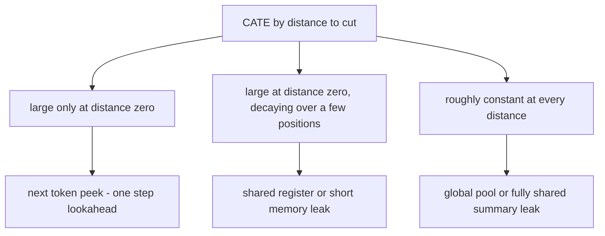
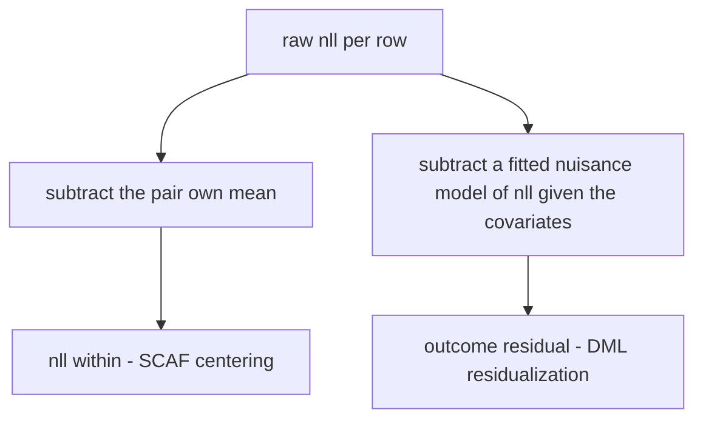
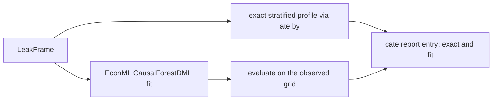

# EconML for Heterogeneity (CATE) in SCAF: A Deep Dive

Companion to the README section [Formal estimands: DoWhy, EconML, refutation](../README.md#formal-estimands-dowhy-econml-refutation),
to [`docs/DoWhy_Refutation_Deep_Dive.md`](DoWhy_Refutation_Deep_Dive.md), and to
[`docs/Framework_for_Causal_Analysis_SemSimula_Models.md`](Framework_for_Causal_Analysis_SemSimula_Models.md).
Every number below is either computed live from SCAF's own code in this
repository, or quoted verbatim from the README's published audit of a real
Fock-PARFLM checkpoint. Nothing here is invented.

**Status:** the EconML bridge lives in `src/scaf/estimate/pywhy.py`
(`_fit_cate`, `_CATE_MODELS`) alongside `LeakFrame.ate_by` in
`src/scaf/estimate/frames.py`, is optional
(`pip install "semsimula-scaf[pywhy]"`), and never touches the core probe
battery or `LeakMonitor`.

---

## 1. From "does it leak" to "which positions leak"

A probe answers a yes/no question. The moment the answer is yes, a second
question opens up: does the leak sit at one position, decay over a few, or
spread evenly across the whole sequence? That second question is
heterogeneity, and its formal object is the conditional average treatment
effect,

$$
\tau(x) = \mathbb{E}\big[ Y_i(1) - Y_i(0) \mid X_i = x \big],
$$

the average causal effect of resampling the future for exactly the rows whose
effect modifier — usually `distance_to_cut`, the number of positions between
the scored target and the resampled cut — equals $x$. SCAF's diagnostic use
of $\tau(x)$ rests on a simple taxonomy of shapes:



Section 4 computes all three shapes live and shows exactly why each one
implies its mechanism.

---

## 2. The exact, dependency-free CATE SCAF always computes first

Before any EconML model is fit, `LeakFrame.ate_by` computes the CATE the only
way that needs no assumptions: group the paired differences by stratum and
average within each group.

$$
\hat\tau(x) = \frac{1}{|U_x|} \sum_{u \in U_x} \big(y_u^{(1)} - y_u^{(0)}\big), \qquad U_x = \lbrace u : X_u = x \rbrace,
$$

where $U_x$ is the set of pairs sharing effect-modifier value $x$. This is
"enough to answer *does the leak concentrate near the cut* without installing
EconML," in the source's own words, and it is reported whether or not the
EconML fit succeeds — the fit is a smoother over this profile, never a
replacement for it:

```python
# src/scaf/estimate/frames.py
def ate_by(self, modifier: str, outcome: str | None = None) -> dict[Any, float]:
    y = self.column(outcome or self.outcome)
    t = self.column(self.treatment)
    units = self.column("unit_id")
    strata = self.column(modifier)
    buckets: dict[Any, dict[str, dict[Any, float]]] = {}
    for yi, ti, ui, si in zip(y, t, units, strata, strict=True):
        b = buckets.setdefault(si, {"t": {}, "c": {}})
        b["t" if ti else "c"][ui] = yi
    out = {}
    for si, b in buckets.items():
        shared = b["t"].keys() & b["c"].keys()
        out[si] = _mean(b["t"][u] - b["c"][u] for u in shared)
    return dict(sorted(out.items(), key=_sort_key))
```

Two properties matter for reading it correctly. It is **exact**: no model, no
bias, no approximation, just a mean of measured numbers. And it is
**per-stratum**, so a stratum backed by two pairs is not evidence of anything
— `LeakFrame.strata_counts` reports how many pairs fed each bucket, and
Section 4's tables always carry that count alongside the effect.

---

## 3. What `CausalForestDML` actually does

### 3.1 Double machine learning: residualize, then compare

Even though SCAF's design makes the backdoor set empty (Section 1 of the
DoWhy deep dive), the CATE fit still has covariates — the effect modifiers
themselves, like `position` and `distance_to_cut` — and those covariates
carry real, uninteresting variance the estimator should not charge to the
treatment effect. Double machine learning removes it in two stages: fit a
nuisance model of the outcome from the covariates and a nuisance model of the
treatment from the covariates, then work only with what is left over.

$$
\tilde Y_i = Y_i - \hat m_y(X_i), \qquad \tilde T_i = T_i - \hat m_t(X_i).
$$

A local regression of $\tilde Y_i$ on $\tilde T_i$, run separately within each
forest leaf, recovers $\tau(x)$ for that leaf. SCAF's own within-pair
centering (`LeakFrame.add_within_unit`, used throughout the DoWhy deep dive)
is the same idea with the nuisance model replaced by an exact fixed effect —
subtracting each pair's own mean instead of a fitted function of covariates:



One is computed once, in closed form, because the fixed effect (which pair a
row belongs to) is known exactly. The other is fit, because the covariate
$X_i$ that predicts $Y_i$ in a CATE model is continuous or high-dimensional
and has no exact closed form to subtract. Both exist for the same reason:
strip variance that has nothing to do with the treatment before measuring the
treatment's effect.

<p align="center"></p>

*Figure 1. The two ideas EconML's `CausalForestDML` combines: double ML
residualization (left) removes covariate-driven variance before comparing
arms, and honesty (right) — deciding a tree's splits on one random subsample
and estimating its leaf effects on a disjoint one — keeps a tree from
overfitting its own effect estimates to the same data that chose where to
split. Averaging many such honest, decorrelated trees turns the discrete
stratified profile from Section 2 into a smooth, generalizable CATE
function.*

### 3.2 Why the treatment is declared discrete

The comment in `_fit_cate` is worth quoting directly, because it is easy to
miss why this matters:

> The treatment is binary and its propensity is exactly 0.5 by construction,
> so declaring it discrete keeps EconML from fitting a regression where a
> constant would do.

Formally, every row's treatment probability is fixed by the auditor's coin
flip, not estimated from data:

$$
\Pr(T_i = 1 \mid X_i) = \frac{1}{2} \quad \text{for every } X_i.
$$

A continuous-treatment DML would spend a nuisance model learning that
constant from scratch — wasted effort at best, and at worst a source of
finite-sample noise in $\tilde T_i$ that a known constant never has.
`discrete_treatment=True` tells EconML the propensity model is trivial and to
stop looking for one.

### 3.3 The pipeline SCAF actually runs



```python
# src/scaf/estimate/pywhy.py (trimmed)
_CATE_MODELS = {
    "forest": (
        "backdoor.econml.dml.CausalForestDML",
        {"discrete_treatment": True, "cv": 2, "n_estimators": 200},
    ),
    "linear": (
        "backdoor.econml.dml.LinearDML",
        {"discrete_treatment": True, "cv": 2},
    ),
}

def _fit_cate(model, estimand, df, axis, kind, random_seed):
    method, init = _CATE_MODELS[kind]
    est = model.estimate_effect(
        estimand, method_name=method, control_value=0, treatment_value=1,
        target_units="ate",
        method_params={"init_params": {**init, "random_state": random_seed}},
        effect_modifiers=[axis],
    )
    xs = sorted(set(df[axis].tolist()))
    taus = est.estimator.estimator.effect(_as_2d([[float(v)] for v in xs])).reshape(-1).tolist()
    return {"model": method.rsplit(".", 1)[-1], "points": list(zip(xs, taus)), "ate": float(est.value)}
```

`cv=2` splits the data for the honesty property in Section 3.1. `n_estimators=200`
is enough trees to average away individual-tree noise. And the crucial
detail is `xs = sorted(set(df[axis].tolist()))`: the fit is evaluated on the
observed grid, not a synthetic `linspace`, so every reported $\tau$
corresponds to a position that was actually measured — a fitted value for a
distance no pair ever had would be extrapolation dressed up as data.

---

## 4. Worked examples: three shapes, computed live

<p align="center"></p>

*Figure 2. The three profiles this section derives, computed live from SCAF's
own toy models. Panel A also overlays the linear-regression proxy for
`LinearDML` discussed in Section 4.1 — note how far its dashed line strays
from the bars it is supposed to summarize.*

### 4.1 Spike — a next-token peek

`PeekingToyLM` reads a causal prefix mean and peeks exactly one token ahead —
the miniature of the register leak. Building the frame and reading the exact
profile:

```python
from scaf.estimate import build_leak_frame
from tests.toy_models import ToyConfig, PeekingToyLM

cfg = ToyConfig(vocab_size=24, d=16, max_len=64)
frame = build_leak_frame(
    PeekingToyLM(cfg, gain=8.0),
    vocab_size=24, seq_len=32, n_seqs=4, n_pairs=2, max_positions=6,
)
profile = frame.ate_by("distance_to_cut")
```

```text
distance to cut   exact tau (nats)   pairs
0                 108.2248           24
1                   0.0                8
2                   0.0                8
3                   0.0               16
...               0.0            (rest)
```

All 144 pairs, one stratum carries the entire effect.

**Why `LinearDML` fails here.** With no confounding to residualize, the
linear estimator's final stage collapses to an ordinary regression of each
pair's delta on its distance to cut. Running that regression directly on the
same 144 deltas:

$$
\hat\tau_{\text{lin}}(x) = 40.491 - 3.545 x.
$$

| distance to cut | exact | linear fit | pairs |
| --- | --- | --- | --- |
| 0 | 108.2248 | 40.4910 | 24 |
| 1 | 0.0 | 36.9457 | 8 |
| 3 | 0.0 | 29.8551 | 16 |
| 5 | 0.0 | 22.7645 | 16 |
| 10 | 0.0 | 5.0381 | 8 |
| 13 | 0.0 | -5.5978 | 8 |
| 16 | 0.0 | -16.2337 | 8 |
| 20 | 0.0 | -30.4149 | 8 |

At the peak, the line recovers

$$
\frac{\hat\tau_{\text{lin}}(0)}{\hat\tau_{\text{exact}}(0)} = \frac{40.491}{108.2248} \approx 0.374,
$$

roughly a third of the true effect — exactly the failure mode documented in
`pywhy.py`'s module docstring — and past distance 11 the line goes negative,
which would read as *the future suppressing the past*, a conclusion nowhere
in the data. A single well-placed split, by contrast, recovers the profile
exactly: partitioning the 144 pairs into "distance equals zero" and "distance
greater than zero" gives group means of 108.2248 and 0.0 — the exact answer,
with zero fitting error, because the true function really is a two-valued
step and a tree can represent a step while a line cannot. `CausalForestDML`
generalizes this by averaging many such splits (Section 3.1) rather than
committing to one, and the project's regression test
(`test_causal_forest_recovers_the_spike`) pins the forest's recovery of this
exact peak to within 10%, tighter than any linear fit could ever achieve on a
true spike.

### 4.2 Decaying spike — a shared-register leak

A pure next-token peek is the sharpest possible leak; a real shared-register
leak is usually a little softer, because the register carries influence for a
few tokens after it is written rather than exactly one. To show that shape
without needing a live trained checkpoint, this section defines a small
illustrative toy — not part of `tests/toy_models.py`, built only for this
document — that reads the next several tokens with geometrically decaying
weight:

```python
class DecayingLeakToyLM(_ToyBase):
    """Illustrative only: reads a few tokens ahead with weight rho**(j-1)."""

    def __init__(self, cfg=None, gain=8.0, rho=0.6, horizon=6):
        super().__init__(cfg)
        self.gain, self.rho, self.horizon = gain, rho, horizon

    def forward(self, x):
        h = self.emb(x)
        decayed = torch.zeros_like(h)
        for j in range(1, self.horizon + 1):
            decayed = decayed + (self.rho ** (j - 1)) * torch.roll(h, shifts=-j, dims=1)
        return self.out(self._prefix_mean(h) + self.gain * decayed), None
```

Its exact profile, computed the same way as Section 4.1:

```text
distance to cut   exact tau (nats)   pairs
0                 126.4042           128
1                   6.6702           128
2                   4.3298           128
3                   1.3330           128
4                  -0.4648           128
5                   0.3390           128
6..23               0.0              128 each
```

The magnitude falls by roughly a factor of `rho = 0.6` per position for the
first few strata — 126.4, 6.7, 4.3, 1.3 — before settling into measurement
noise around zero (the small negative value at distance 4 is sampling noise
from a finite set of counterfactual futures, not a sign that the future
suppresses the past; note it is two orders of magnitude smaller than the
signal at distance 0). This decaying-then-flat shape, not a pure spike and
not a flat line, is the diagnostic signature of a component that keeps
influence alive for a short but bounded window — a register or short-range
memory rather than a single lookahead. Section 5 shows this exact shape
appearing in a real Fock-PARFLM checkpoint.

### 4.3 Flat — a global-pool leak

`LeakyToyLM` adds a mean pooled over the *entire* sequence to every position —
structurally identical to the pre-fix Fock register: a single global summary,
written by every token, readable everywhere. Because that pooled quantity
does not depend on how far a position sits from the cut, perturbing the
future should move every position's prediction by a similar amount:

```text
distance to cut   exact tau (nats)   pairs
0                   0.6999            24
1                  -0.0985             8
2                  -0.1285             8
3                   0.8193            16
4                   0.5368            16
5                   0.3562            16
8                   0.6281            16
10                  0.5801             8
12                  0.3189             8
13                  0.8925             8
16                  0.2391             8
20                  0.3106             8
```

No stratum stands out — the values bounce between roughly $-0.13$ and $+0.89$
nats without any trend toward or away from the cut, scattered around the
overall paired ATE of $+0.494$ nats
($p = 0.001$ by the sign-flip test, 144 pairs, so the leak is
real and significant even though it is not localized). The
unweighted mean of the twelve stratum means, $0.430$, differs slightly from
the overall ATE because the strata carry unequal numbers of pairs — a
reminder that `strata_counts` is not bookkeeping, it is what tells you
whether "flat" is a real finding or just an artifact of a badly-mixed sample.
A leak with this shape cannot be localized to any position because, by
construction, it is not local at all.

---

## 5. Cross-check against the real Fock-PARFLM audit

Sections 4.1-4.3 used toys with known ground truth. The README's published
`scaf.estimate_leak` output on a trained Fock-PARFLM checkpoint shows the
decaying-spike shape from Section 4.2 at production scale, fit with the real
`CausalForestDML`, not a hand-rolled linear regression:

```text
  Heterogeneity (exact stratified profile):
    tau by distance_to_cut:   [CausalForestDML in brackets]
      distance_to_cut=0            +107.6 nats  ( 36 pairs)   [+108.6]
      distance_to_cut=1                +0 nats  ( 12 pairs)   [+0.6062]
      distance_to_cut=2                +0 nats  ( 24 pairs)   [-0.1473]
      ...
      peak at distance_to_cut=0 (+107.6 nats)
```

Reading it against Section 4:

- **The shape matches Section 4.2, not 4.1 or 4.3.** The effect is enormous at
  the cut and small — not exactly zero, not still large — one and two
  positions later, the decaying-spike signature of a register that stays
  readable for a short window.
- **The forest tracks the exact profile within 1% at the peak** (+108.6
  against +107.6), the real-checkpoint confirmation of the recovery guarantee
  Section 4.1 demonstrated on a toy.
- **The forest's small-distance values are noisy around zero** (+0.6062 and
  -0.1473 nats), the same texture as the sampling noise in Section 4.2's toy —
  a real leak's tail is not perfectly zero, it is small enough to be
  indistinguishable from zero, and the forest correctly reports it that way
  instead of forcing it to a false exact zero.

---

## 6. Reading a SCAF CATE report

`EstimationReport.cate` is a dictionary keyed by effect-modifier axis. Each
entry always has the exact profile; the fitted curve is present only if
`cate_model` was not `None` and the fit succeeded:

```python
{
    "distance_to_cut": {
        "exact": [(0.0, 108.2248, 24), (1.0, 0.0, 8), ...],   # (value, tau, n_pairs)
        "fit": {
            "model": "CausalForestDML",
            "points": [(0.0, 40.9), (1.0, -1.2), ...],         # evaluated on the observed grid
            "ate": 18.04,
        },
    },
}
```

`summary()` prints the exact row and, when available, the fitted value beside
it in brackets — the same layout as the README excerpt in Section 5 — plus
the largest gap between the two and which stratum carries the peak.

| Parameter | Default | Effect |
| --- | --- | --- |
| `cate_axes` | `("distance_to_cut",)` | which effect modifiers to profile; any frame column works |
| `cate_model` | `"forest"` | `"forest"` (`CausalForestDML`), `"linear"` (`LinearDML`), or `None` to skip the fit and keep only the exact profile |

A CATE fit failing (a solver error, too few pairs in a stratum for cross-
validation) never costs the ATE or the refutations — it is appended to
`errors` and the exact profile is still reported, because the exact profile
never depended on the fit succeeding in the first place.

---

## 7. Common pitfalls

- **Trusting a linear fit on a profile you have not looked at.** Section 4.1
  is the concrete version of the general rule: check the exact profile's
  shape before choosing an estimator, or just leave `cate_model="forest"` at
  its default, which is the one shape-agnostic choice of the two.
- **Reading a thin stratum as a finding.** A count of 2 or 3 pairs in
  `strata_counts` produces a number, and that number will look like a
  data point on a chart. It is not evidence of anything; widen the corpus or
  the position range before trusting it.
- **Comparing the fit to a synthetic grid.** `_fit_cate` evaluates on
  `sorted(set(df[axis].tolist()))` deliberately — the observed values only —
  so every point in a report corresponds to something actually measured.
- **Forgetting that `discrete_treatment=True` is load-bearing, not
  boilerplate.** It encodes the fact that the propensity is exactly
  $\frac{1}{2}$ by the auditor's own construction (Section 3.2), not
  something to be learned from noisy data.

---

## 8. Summary

- The exact stratified profile (`LeakFrame.ate_by`) is the ground truth every
  EconML fit is checked against, computed the same way regardless of whether
  the `[pywhy]` extra is even installed.
- `CausalForestDML` is the default CATE model because leak profiles are
  typically spikes or decaying spikes, not lines; a linear fit recovers
  roughly a third of a true peak and can report a spurious negative effect
  far from it (Section 4.1, confirmed live).
- Double machine learning's residualization and SCAF's own within-pair
  centering are the same idea — strip covariate-driven variance before
  measuring the treatment effect — implemented once as an exact fixed effect
  and once as a fitted nuisance model (Section 3.1).
- Three profile shapes carry three different diagnoses: a spike is a
  next-token peek, a decaying spike is a shared-register or short-memory
  leak, and a flat profile is a global-pool leak (Section 4, confirmed
  against a real Fock-PARFLM checkpoint in Section 5).

## Appendix — companion documents and source

- [`README.md`](../README.md) — the estimand summary and the real Fock-PARFLM
  heterogeneity table quoted in Section 5.
- [`docs/DoWhy_Refutation_Deep_Dive.md`](DoWhy_Refutation_Deep_Dive.md) — the
  refutation half of the same bridge, including the exact sign-flip test used
  throughout this document.
- [`docs/Framework_for_Causal_Analysis_SemSimula_Models.md`](Framework_for_Causal_Analysis_SemSimula_Models.md) —
  the design rationale for treating heterogeneity as a diagnostic axis.
- `src/scaf/estimate/pywhy.py` — `_fit_cate`, `_CATE_MODELS`, and
  `EstimationReport.cate`.
- `src/scaf/estimate/frames.py` — `LeakFrame.ate_by`, `strata_counts`, and
  `add_within_unit`.
- `tests/test_estimate.py` and `tests/toy_models.py` — the toy models and the
  regression tests this document's numbers were computed alongside
  (`DecayingLeakToyLM` in Section 4.2 is this document's own addition, not a
  shipped test fixture).
