# Example Stiffness Audit: OWT, γ=0.10, Anisotropic Gaussian, Verlet-Trained

**Status:** worked example against a real run, plus a design extension
(Phase 7b) that has been implemented in the notebook but not yet executed
against this checkpoint's own weights. §3's numbers are real measurements;
§5-§7's Weyl-bound statistic is verified against synthetic data (§6) but
still pending a real run (§8) — this document says exactly which is which
throughout.

**Companion:**
[`docs/Stiffness_Audit_Requirements_and_Design.md`](Stiffness_Audit_Requirements_and_Design.md)
(the audit this document is an example of),
[`notebooks/conservative_arch/scaleup/debug/scaf_checkpoint_analysis.ipynb`](https://github.com/dimitarpg13/semsimula-paper/blob/main/notebooks/conservative_arch/scaleup/debug/scaf_checkpoint_analysis.ipynb)
(Phase 7 and 7b, the implementation this document walks through),
[`model_aniso_gaussian_vtheta.py`](https://github.com/dimitarpg13/semsimula-paper/blob/main/notebooks/conservative_arch/parf/model_aniso_gaussian_vtheta.py)
(the `harmonic_terms()` implementation §5 extends).

---

## 1. The experiment under test

| | |
| --- | --- |
| Corpus | OpenWebText |
| `V_theta` family | anisotropic Gaussian, depth-conditioned, `K=8` wells, `n_ctx=5`, low-rank correction `rank=4` |
| `gamma_train` | 0.10 |
| Integrator (as trained) | Velocity-Verlet |
| Run length | audited up to step 15,000 (still training) |
| Checkpoints audited | steps 9000, 9500, 10000, 15000 (`_best.pt` / raw, all four carry `model_cfg`) |

This is the same run documented in
[`docs/Stiffness_Audit_Requirements_and_Design.md`](Stiffness_Audit_Requirements_and_Design.md)
§2's empirical fact: its `training_log.jsonl` logs 15 `watchdog_reload`
events between step 8925 and step 16824,

```text
8925, 10409, 10697, 10721, 11550, 11898,
12559, 12808, 13293, 13903, 15434, 15906, 16280, 16612, 16824
```

with `ema_grad_norm` climbing from about 115 at the first reload to about
285 at the worst one. The question this audit asks is direct: **was any
sampled token, at any of these four checkpoints, sitting in a well sharp
enough to make a Verlet step unstable ($\omega \Delta t \ge 2$)?**

---

## 2. The bound, in one line

Velocity-Verlet is stable if and only if $\omega \Delta t \lt 2$, where
$\omega = \sqrt{K/\mathfrak{m}}$ for local curvature $K$ and per-layer mass
$\mathfrak{m}$. Full derivation lives in the design doc linked above and
the PyTorch implementation deep dive it cites; this document only needs
the number `2` and the fact that `harmonic_terms()` is what turns a
checkpoint's frozen weights into a per-token, per-layer sample of $K$.

---

## 3. Phase 7 results — real measurements

Running Phase 7 of `scaf_checkpoint_analysis.ipynb` against the four
checkpoints above (`STIFFNESS_N_BATCHES=16`, `STIFFNESS_BATCH_SZ=2`,
`STIFFNESS_BLOCK_LEN=256`) produced:

| step | val_ppl | median | p90 | p99 | p99.9 | max | frac(>2) |
| --- | --- | --- | --- | --- | --- | --- | --- |
| 9000 | 194.68 | 0.0000 | 0.0002 | 0.190 | 0.217 | 0.632 | 0 |
| 9500 | 191.84 | 0.0000 | 0.0000 | 0.188 | 0.212 | 0.342 | 0 |
| 10000 | 184.11 | 0.0000 | 0.0000 | 0.189 | 0.218 | 0.471 | 0 |
| 15000 | 192.53 | 0.0000 | 0.0000 | 0.189 | 0.215 | 0.418 | 0 |

<p align="center"></p>

Every number in this figure is copied verbatim from the notebook's printed
output; the generator script is
`docs/images/_make_example_stiffness_audit_owt_g0_1_figures.py`.

### 3.1 Reading it

At every one of the four checkpoints, $\omega \Delta t$ never approaches
the instability bound: the single stiffest token/layer/dimension sampled
across roughly $16 \times 2 \times 256 \times 384$ scalars per checkpoint
tops out at `0.632` (step 9000) — more than 3x below the bound, and
`frac(omega*dt>2)` is exactly `0` at all four steps. Taken at face value,
**the axis-aligned well-curvature mechanism does not explain this run's
watchdog reloads** — at least not on the validation windows sampled here,
and not at the specific steps audited.

That conclusion needs the caveat in §4-§7 before it can be trusted,
because of exactly what family is under test.

---

## 4. Why this specific family needs a second look

`harmonic_terms()` is exact for isotropic wells. For the anisotropic
Gaussian family under test here, it is not (`model_aniso_gaussian_vtheta.py`,
lines 199-247):

```python
    def harmonic_terms(
        self, xi: torch.Tensor, h: torch.Tensor, *, comps=None,
    ) -> tuple[torch.Tensor, torch.Tensor]:
        """Frozen-coefficient diagonal harmonic model of the force at ``h``.

        The force of this potential is *exactly* a sum of linear springs
        with state-dependent coefficients:

            f(h) = -grad_h V = -sum_k g_k P_k (h - mu_k),
            g_k  = w_k exp(-0.5 diff_k^T P_k diff_k) > 0,
            P_k  = diag(a_k) + B_k B_k^T.

        Keeping only the diagonal of each ``P_k`` gives a per-dimension
        spring whose exact flow the CfC propagator can integrate
        (``cfc_baoab.cfc_substep``):

            k_diag = sum_k g_k diag(P_k),      diag(P_k) = a_k + rowsum(B_k^2)
            s      = sum_k g_k diag(P_k) mu_k
            f_harm(h') = s - k_diag * h'
        ...
        """
        mu, a, w, B = self._components(xi) if comps is None else comps
        h_e = h.unsqueeze(-2)
        diff = h_e - mu

        diag_term = (a * diff * diff).sum(dim=-1)
        Bt_diff = torch.einsum('...kd,...kdr->...kr', diff, B)
        lr_term = (Bt_diff * Bt_diff).sum(dim=-1)

        g = w * torch.exp(-0.5 * (diag_term + lr_term))          # (..., K)

        p_diag = a + (B * B).sum(dim=-1)                          # (..., K, d)
        gp = g.unsqueeze(-1) * p_diag                             # (..., K, d)

        k_diag = gp.sum(dim=-2)                                   # (..., d)
        s = (gp * mu).sum(dim=-2)                                 # (..., d)
        return k_diag, s
```

`k_diag` folds each rank-4 correction's *row sums* into the diagonal
(`a + (B*B).sum(dim=-1)`), but discards its off-diagonal structure. The
true precision matrix $P_k = \mathrm{diag}(a_k) + B_k B_k^\top$ can have a
top eigenvalue well above any individual diagonal entry, if $B_k$
concentrates curvature along a direction that is not axis-aligned — which
is exactly the mechanism anisotropic wells have that isotropic wells do
not. `k_diag`'s reported `max=0.632` therefore certifies that the
*axis-aligned* curvature stayed safe; it says nothing about a rotated
direction it cannot see.

<p align="center"></p>

---

## 5. Closing the gap: a Weyl-inequality upper bound

Weyl's inequality states that for symmetric matrices $A, C$,
$\lambda_{\max}(A + C) \le \lambda_{\max}(A) + \lambda_{\max}(C)$. Applied
to $P_k = \mathrm{diag}(a_k) + B_k B_k^\top$:

$$
\lambda_{\max}(P_k) \;\le\; \max_i a_k[i] \;+\; \sigma_{\max}(B_k)^2 ,
$$

where $\sigma_{\max}(B_k)^2$ is the top eigenvalue of the small
$\mathrm{rank} \times \mathrm{rank}$ Gram matrix $B_k^\top B_k$ — cheap to
compute exactly (rank is 4 here, so this is a 4x4 eigendecomposition, not a
$d \times d$ one). Aggregating the same way `k_diag` aggregates
$\mathrm{diag}(P_k)$ (weighted by the same per-well $g_k$), and applying
Weyl's inequality a second time across wells:

$$
\lambda_{\max}\Big(\textstyle\sum_k g_k P_k\Big)
\;\le\; \sum_k g_k\,\lambda_{\max}(P_k)
\;\le\; \sum_k g_k\Big(\max_i a_k[i] + \sigma_{\max}(B_k)^2\Big)
\;=:\; K_{\text{Weyl}}(h).
$$

Since `k_diag` $= \sum_k g_k \mathrm{diag}(P_k)$ is exactly the diagonal
of $\sum_k g_k P_k$, its per-dimension maximum sits below that same
matrix's true top eigenvalue, which sits below $K_{\text{Weyl}}(h)$:

$$
\max_i\big(\text{k\_diag}(h)\big)_i \;\le\; \lambda_{\max}\Big(\textstyle\sum_k g_k P_k\Big) \;\le\; K_{\text{Weyl}}(h) .
$$

$K_{\text{Weyl}}(h)$ is a **conservative, any-direction** certificate: it
can only overstate the true worst-case curvature (a false alarm), never
understate it (a missed instability).

---

## 6. Verifying the inequality holds (synthetic, not this checkpoint)

Before wiring this into the notebook, the chain of inequalities in §5 was
checked directly: 500 trials of random `K=8`-well anisotropic mixtures
(`d=16`, `rank=4`), each compared against the exact eigendecomposition of
the true effective matrix $\sum_k g_k P_k$.

<p align="center"></p>

Result: `k_diag`'s per-dimension max **underestimated the true top
eigenvalue in all 500/500 trials** (mean gap `3.77`, on a typical
eigenvalue scale of `5`-`18`), and the Weyl bound never once fell below
the true value. This is a property of the inequality itself, not of any
particular checkpoint's weights — it confirms the math in §5 is safe to
apply before spending GPU time running it against real checkpoints.

---

## 7. Phase 7b: wiring it into the audit

Phase 7b does not run a second forward pass. Phase 7's own
`_stiffness_report` already forces the harmonic linearisation on and
monkeypatches `harmonic_terms()` once per layer; Phase 7b adds a second,
chained monkeypatch one level down, on the multi-context bank that the
outer patch's saved original delegates to internally — so both statistics
come from the exact same forward passes, at the same sampled positions:

```mermaid
flowchart LR
    LAYER["Real layer step calls harmonic&#95;terms once"]
    OUTERPATCH["Outer patch: V&#95;theta.harmonic&#95;terms records k&#95;diag"]
    INNERPATCH["Inner patch: bank.harmonic&#95;terms records Weyl bound"]
    BOTH["Both samples appended for the same token and layer"]

    LAYER --> OUTERPATCH
    OUTERPATCH --> INNERPATCH
    INNERPATCH --> BOTH
```



```python
multi = getattr(mdl.V_theta, 'bank', mdl.V_theta)
_has_aniso = (hasattr(multi, 'banks')
              and any(getattr(b, 'rank', 0) > 0 for b in multi.banks))
_orig_bank_ht = multi.harmonic_terms if _has_aniso else None

def _recording_bank(xis, h, comps=None):
    k_diag_b, s_b = _orig_bank_ht(xis, h, comps=comps)
    total = torch.zeros(h.shape[:-1], device=h.device, dtype=h.dtype)
    for m_ctx in range(multi.n_ctx):
        bank_m = multi.banks[m_ctx]
        # comps, when supplied, IS (mu, a, w, B) already -- reuse it
        # instead of re-deriving from xis (see note below).
        if comps is not None:
            mu_m, a_m, w_m, B_m = comps[m_ctx]
        else:
            mu_m, a_m, w_m, B_m = bank_m._components(xis[..., m_ctx, :])
        diff = h.unsqueeze(-2) - mu_m
        diag_term = (a_m * diff * diff).sum(dim=-1)
        Bt_diff = torch.einsum('...kd,...kdr->...kr', diff, B_m)
        lr_term = (Bt_diff * Bt_diff).sum(dim=-1)
        g_m = w_m * torch.exp(-0.5 * (diag_term + lr_term))
        a_max_m = a_m.max(dim=-1).values
        gram = torch.einsum('...kdr,...kds->...krs', B_m, B_m)
        sigma_max_sq_m = torch.linalg.eigvalsh(gram)[..., -1]
        total = total + (g_m * (a_max_m + sigma_max_sq_m)).sum(dim=-1)
    seen_eig.append(total.detach().float().flatten().cpu())
    return k_diag_b, s_b
```

`_orig_bank_ht` is what `mdl.V_theta.harmonic_terms`'s own saved original
calls internally when the outer patch's wrapper runs it — so patching
`multi.harmonic_terms` before installing the outer patch means every real
layer step exercises both recordings, once each, in the order the model
would have called them anyway. `_recording_bank` is skipped entirely
(`_has_aniso=False`) for families with no `.banks` structure or with
`rank=0` everywhere, where `k_diag` is already exact and there is nothing
to bound.

**The `comps is not None` branch is load-bearing, not an optimisation.**
`_layer_step_langevin` always precomputes
`vtheta_comps = self.V_theta.context_components(xis)` and forwards it as
`comps=vtheta_comps` — `context_components` exists on the depth-conditioned
wrapper, so this path is taken on every real call. The depth-conditioned
wrapper's own `_maybe_shift(xis, comps)` then *skips applying the
depth-shift to `xis` whenever `comps` is given*, because `xis` is unused
by the rest of the real call chain in that case — only `comps` (which
`context_components` already derived from the correctly shifted context)
is used. `_recording_bank` receives whatever `_maybe_shift` produced, so
if it ignored `comps` and re-derived `(mu, a, w, B)` from `xis` via
`bank_m._components(...)`, it would silently use the *unshifted* context
— correct only for the layer whose shift code happens to be zero. Reusing
`comps[m_ctx]` sidesteps this entirely: it is exactly what the real
forward pass used to compute `k_diag_b`/`s_b` a moment earlier in the same
call, so the Weyl-bound term is guaranteed to describe the same wells.
This is also what makes the "zero extra GPU cost" claim precise rather
than approximate: with `comps` reused, Phase 7b adds no repeated linear
projections at all — only the `O(K \cdot r^2)` eigendecompositions of the
small `r \times r` Gram matrices, on parameters the model already
computed.

This has been implemented in `_stiffness_report` and lands in the
returned dict as `eig_median` / `eig_p90` / `eig_p99` / `eig_p999` /
`eig_max` / `eig_frac_marginal` / `eig_frac_unstable`, alongside the
existing diagonal-proxy keys — plus a standalone Phase 7b cell that reads
`_stiff_rows` (already populated by Phase 7) and produces a side-by-side
comparison table and plot, with no extra checkpoint reloads or forward
passes of its own.

---

## 8. What running it would tell us

Phase 7b has not yet been run against this run's own four checkpoints —
that is the natural next step, not a result this document can report yet.
Three possible outcomes, and what each would mean:

| Outcome | Reading |
| --- | --- |
| `eig_max` stays comfortably below 2 at all four steps, similar margin to `max` | the diagonal blind spot is real in principle (§5-§6) but this run's actual wells happen not to exploit it; the reload mechanism is something other than well curvature entirely |
| `eig_max` crosses 1 or 2 at steps near the reload cluster (`10000`-`15000`, the unaudited gap in §3's figure) while `k_diag`'s `max` stays flat | direct mechanistic evidence that the rotated, off-diagonal direction is exactly what `k_diag` was missing, and the val_ppl backslide in §9 has a concrete curvature explanation |
| `eig_max` is large everywhere, including at steps far from any reload | the Weyl bound is too loose at this `rank=4` to be actionable on its own, and a tighter (but more expensive) exact-eigenvalue check on the small per-well precision matrices would be the next escalation, not a conclusion either way |

Either of the first two outcomes is informative; only the third would
require more work before the audit says anything new.

---

## 9. Corroborating context: the val_ppl backslide

Independent of the curvature question, `val_ppl` in §3's table is not
monotonically improving: `194.68 -> 191.84 -> 184.11` through step 10000,
then **backsliding to 192.53 by step 15000** — worse than both step 9500
and step 10000. That backslide sits inside the exact gap where no
checkpoint was audited and where the reload cluster is densest
(`11550`-`13903`, plus the next cluster starting at `15434`, just past the
last audited step). It is consistent with training still being actively
disrupted through this window even while the diagonal curvature signal
stays flat — which is precisely the kind of discrepancy §8's second
outcome would resolve.

---

## 10. Summary

- Phase 7's real measurements at four checkpoints of this OWT
  `gamma_train=0.10` Verlet run show no axis-aligned Verlet instability:
  `max(omega*dt)` never exceeds `0.632`, `frac(omega*dt>2)=0` everywhere.
- That result is only a certificate along coordinate axes. The anisotropic
  Gaussian family's low-rank correction is specifically the mechanism that
  can hide curvature off-axis, and it is verified (§6, synthetically) that
  the diagonal proxy strictly underestimates the true worst-case curvature
  whenever the low-rank correction is non-trivial.
- Phase 7b (§7) closes that gap with a Weyl-inequality upper bound,
  implemented as a chained monkeypatch that reuses Phase 7's own forward
  passes rather than running new ones. It has not yet been run against
  this run's checkpoints — §8 lays out what each possible result would
  mean once it is.
- The `val_ppl` trajectory backslides right in the unaudited gap between
  step 10000 and step 15000, which is independent evidence that something
  was still wrong in that window regardless of what the curvature audit
  eventually shows.

---

## 11. Open follow-ups

- **Run Phase 7b against this run's own checkpoints** and update §8's
  table with the real outcome — the natural next step, deliberately left
  undone here so this document does not claim a result it has not
  measured.
- **Extend the checkpoint list into the unaudited gap** (`10000`-`15000`)
  so the reload cluster at `11550`-`13903` has its own audited points
  rather than being bracketed from outside.
- **A tighter (exact) alternative to the Weyl bound**, if §8's third
  outcome occurs: since `rank=4` is small, computing the exact top
  eigenvalue of each $d \times d$ matrix $P_k$ via a rank-4 secular
  equation (rather than Weyl's looser, additive bound) would tighten the
  certificate at some extra implementation cost — worth doing only if the
  Weyl bound itself proves too conservative to be actionable.
