# Example Stiffness Audit: OWT, γ=0.10, Anisotropic Gaussian, Verlet-Trained

**Status:** worked example against a real run. §3, §8, and now §3.2/§8.2's
Phase 7c cross-check are all real measurements from this checkpoint's own
weights; §6 verifies the Weyl-bound inequality against synthetic data, not
this checkpoint. Phase 7c's real result (§3.2, §8.2) closes the
trajectory-substitution caveat for this checkpoint set: the forced- and
native-trajectory numbers agree to within noise. The exact-eigenvalue
check (§8.2, §11) remains implemented / designed but not yet run — this
document says exactly which is which throughout.

**Companion:**
[`docs/Stiffness_Audit_Requirements_and_Design.md`](Stiffness_Audit_Requirements_and_Design.md)
(the audit this document is an example of),
[`notebooks/conservative_arch/scaleup/debug/scaf_checkpoint_analysis.ipynb`](https://github.com/dimitarpg13/semsimula-paper/blob/main/notebooks/conservative_arch/scaleup/debug/scaf_checkpoint_analysis.ipynb)
(Phase 7 and 7b, the implementation this document walks through),
[`model_aniso_gaussian_vtheta.py`](https://github.com/dimitarpg13/semsimula-paper/blob/main/notebooks/conservative_arch/parf/model_aniso_gaussian_vtheta.py)
(the `harmonic_terms()` implementation §5 extends).

---

## 1. The experiment under test

| | |
| --- | --- |
| Corpus | OpenWebText |
| `V_theta` family | anisotropic Gaussian, depth-conditioned, `K=8` wells, `n_ctx=5`, low-rank correction `rank=4` |
| `gamma_train` | 0.10 |
| Integrator (as trained) | Velocity-Verlet |
| Run length | audited up to step 15,000 (still training) |
| Checkpoints audited | steps 9000, 9500, 10000, 15000 (`_best.pt` / raw, all four carry `model_cfg`) |

This is the same run documented in
[`docs/Stiffness_Audit_Requirements_and_Design.md`](Stiffness_Audit_Requirements_and_Design.md)
§2's empirical fact: its `training_log.jsonl` logs 15 `watchdog_reload`
events between step 8925 and step 16824,

```text
8925, 10409, 10697, 10721, 11550, 11898,
12559, 12808, 13293, 13903, 15434, 15906, 16280, 16612, 16824
```

with `ema_grad_norm` climbing from about 115 at the first reload to about
285 at the worst one. The question this audit asks is direct: **was any
sampled token, at any of these four checkpoints, sitting in a well sharp
enough to make a Verlet step unstable ($\omega \Delta t \ge 2$)?**

---

## 2. The bound, in one line

Velocity-Verlet is stable if and only if $\omega \Delta t \lt 2$, where
$\omega = \sqrt{K/\mathfrak{m}}$ for local curvature $K$ and per-layer mass
$\mathfrak{m}$. Full derivation lives in the design doc linked above and
the PyTorch implementation deep dive it cites; this document only needs
the number `2` and the fact that `harmonic_terms()` is what turns a
checkpoint's frozen weights into a per-token, per-layer sample of $K$.

---

## 3. Phase 7 results — real measurements

Running Phase 7 of `scaf_checkpoint_analysis.ipynb` against the four
checkpoints above (`STIFFNESS_N_BATCHES=16`, `STIFFNESS_BATCH_SZ=2`,
`STIFFNESS_BLOCK_LEN=256`) produced:

| step | val_ppl | median | p90 | p99 | p99.9 | max | frac(>2) |
| --- | --- | --- | --- | --- | --- | --- | --- |
| 9000 | 194.68 | 0.0000 | 0.0002 | 0.190 | 0.217 | 0.632 | 0 |
| 9500 | 191.84 | 0.0000 | 0.0000 | 0.188 | 0.212 | 0.342 | 0 |
| 10000 | 184.11 | 0.0000 | 0.0000 | 0.189 | 0.218 | 0.471 | 0 |
| 15000 | 192.53 | 0.0000 | 0.0000 | 0.189 | 0.215 | 0.418 | 0 |

<p align="center"></p>

Every number in this figure is copied verbatim from the notebook's printed
output; the generator script is
`docs/images/_make_example_stiffness_audit_owt_g0_1_figures.py`.

### 3.1 Reading it

At every one of the four checkpoints, $\omega \Delta t$ never approaches
the instability bound: the single stiffest token/layer/dimension sampled
across roughly $16 \times 2 \times 256 \times 384$ scalars per checkpoint
tops out at `0.632` (step 9000) — more than 3x below the bound, and
`frac(omega*dt>2)` is exactly `0` at all four steps. Taken at face value,
**the axis-aligned well-curvature mechanism does not explain this run's
watchdog reloads** — at least not on the validation windows sampled here,
and not at the specific steps audited.

That conclusion needs the caveat in §4-§7 before it can be trusted,
because of exactly what family is under test — and a second, independent
caveat about which hidden states it was even measured at, below.

### 3.2 Caveat: which trajectory produced these numbers?

§1 records this run's integrator "as trained" as Velocity-Verlet, and that
matters for how §3's numbers were produced. `harmonic_terms()` — the
function that turns frozen weights into a $K(h)$ sample — is only ever
called from `_layer_step_langevin`, never from `_layer_step` (the real code
path this checkpoint's own Verlet training and inference actually use). To
read `k_diag` off a Verlet-configured model at all, Phase 7's default mode
temporarily forces `cfg.integrator = 'baoab_cfc'` for the duration of the
probe's forward passes, then restores it.

That forcing is not free of side effects. `_layer_step` and
`_layer_step_langevin` compute `h_new` with different functional forms from
the same inputs, so beyond layer 0 (whose input is the
integrator-independent token+position embedding) the numbers in §3's table
were measured at hidden states this checkpoint's *own* Verlet forward pass
would not actually visit — the same trained weights, run through a
different, numerically friendlier stand-in integrator instead. Full
derivation in
[`Stiffness_Audit_Requirements_and_Design.md`](Stiffness_Audit_Requirements_and_Design.md)
§4.4.

A `native=True` mode exists specifically to close this gap: it leaves
`cfg.integrator` untouched and instead hooks `_layer_forces` to sample
`harmonic_terms()` at the real `(h, xis)` the checkpoint's own Verlet step
is evaluating a force at, so `h_new` stays bit-identical to an unhooked
forward pass. **It has now been run against this run's own four
checkpoints (Phase 7c):**

| step | diag max, forced | diag max, native | diag frac(>2), forced | diag frac(>2), native |
| --- | --- | --- | --- | --- |
| 9000 | 0.6319 | 0.4520 | 0.000e+00 | 0.000e+00 |
| 9500 | 0.3423 | 0.6376 | 0.000e+00 | 0.000e+00 |
| 10000 | 0.4711 | 0.3931 | 0.000e+00 | 0.000e+00 |
| 15000 | 0.4182 | 0.4868 | 0.000e+00 | 0.000e+00 |

`diag max` moves by a similar amount in either direction under the native
trajectory (sometimes lower, sometimes higher than forced) — expected,
since `max` is a single most-extreme sampled position and individual
positions are exactly what a different integrator's later-layer states
are free to disagree on. `frac(>2)` stays at exactly `0` in both modes at
every checkpoint, so the "not curvature-limited along the axes" verdict
from §3.1 is confirmed to survive the trajectory swap, not just assumed
to. The far more informative version of this same cross-check is on the
Weyl-bound statistic, in §8.2 below, where the aggregate `frac(>2)` is
nonzero and the trajectory-fidelity question actually has something to
settle.

---

## 4. Why this specific family needs a second look

`harmonic_terms()` is exact for isotropic wells. For the anisotropic
Gaussian family under test here, it is not (`model_aniso_gaussian_vtheta.py`,
lines 199-247):

```python
    def harmonic_terms(
        self, xi: torch.Tensor, h: torch.Tensor, *, comps=None,
    ) -> tuple[torch.Tensor, torch.Tensor]:
        """Frozen-coefficient diagonal harmonic model of the force at ``h``.

        The force of this potential is *exactly* a sum of linear springs
        with state-dependent coefficients:

            f(h) = -grad_h V = -sum_k g_k P_k (h - mu_k),
            g_k  = w_k exp(-0.5 diff_k^T P_k diff_k) > 0,
            P_k  = diag(a_k) + B_k B_k^T.

        Keeping only the diagonal of each ``P_k`` gives a per-dimension
        spring whose exact flow the CfC propagator can integrate
        (``cfc_baoab.cfc_substep``):

            k_diag = sum_k g_k diag(P_k),      diag(P_k) = a_k + rowsum(B_k^2)
            s      = sum_k g_k diag(P_k) mu_k
            f_harm(h') = s - k_diag * h'
        ...
        """
        mu, a, w, B = self._components(xi) if comps is None else comps
        h_e = h.unsqueeze(-2)
        diff = h_e - mu

        diag_term = (a * diff * diff).sum(dim=-1)
        Bt_diff = torch.einsum('...kd,...kdr->...kr', diff, B)
        lr_term = (Bt_diff * Bt_diff).sum(dim=-1)

        g = w * torch.exp(-0.5 * (diag_term + lr_term))          # (..., K)

        p_diag = a + (B * B).sum(dim=-1)                          # (..., K, d)
        gp = g.unsqueeze(-1) * p_diag                             # (..., K, d)

        k_diag = gp.sum(dim=-2)                                   # (..., d)
        s = (gp * mu).sum(dim=-2)                                 # (..., d)
        return k_diag, s
```

`k_diag` folds each rank-4 correction's *row sums* into the diagonal
(`a + (B*B).sum(dim=-1)`), but discards its off-diagonal structure. The
true precision matrix $P_k = \mathrm{diag}(a_k) + B_k B_k^\top$ can have a
top eigenvalue well above any individual diagonal entry, if $B_k$
concentrates curvature along a direction that is not axis-aligned — which
is exactly the mechanism anisotropic wells have that isotropic wells do
not. `k_diag`'s reported `max=0.632` therefore certifies that the
*axis-aligned* curvature stayed safe; it says nothing about a rotated
direction it cannot see.

<p align="center"></p>

---

## 5. Closing the gap: a Weyl-inequality upper bound

Weyl's inequality states that for symmetric matrices $A, C$,
$\lambda_{\max}(A + C) \le \lambda_{\max}(A) + \lambda_{\max}(C)$. Applied
to $P_k = \mathrm{diag}(a_k) + B_k B_k^\top$:

$$
\lambda_{\max}(P_k) \;\le\; \max_i a_k[i] \;+\; \sigma_{\max}(B_k)^2 ,
$$

where $\sigma_{\max}(B_k)^2$ is the top eigenvalue of the small
$\mathrm{rank} \times \mathrm{rank}$ Gram matrix $B_k^\top B_k$ — cheap to
compute exactly (rank is 4 here, so this is a 4x4 eigendecomposition, not a
$d \times d$ one). Aggregating the same way `k_diag` aggregates
$\mathrm{diag}(P_k)$ (weighted by the same per-well $g_k$), and applying
Weyl's inequality a second time across wells:

$$
\lambda_{\max}\Big(\textstyle\sum_k g_k P_k\Big)
\;\le\; \sum_k g_k\,\lambda_{\max}(P_k)
\;\le\; \sum_k g_k\Big(\max_i a_k[i] + \sigma_{\max}(B_k)^2\Big)
\;=:\; K_{\text{Weyl}}(h).
$$

Since `k_diag` $= \sum_k g_k \mathrm{diag}(P_k)$ is exactly the diagonal
of $\sum_k g_k P_k$, its per-dimension maximum sits below that same
matrix's true top eigenvalue, which sits below $K_{\text{Weyl}}(h)$:

$$
\max_i\big(\text{k\_diag}(h)\big)_i \;\le\; \lambda_{\max}\Big(\textstyle\sum_k g_k P_k\Big) \;\le\; K_{\text{Weyl}}(h) .
$$

$K_{\text{Weyl}}(h)$ is a **conservative, any-direction** certificate: it
can only overstate the true worst-case curvature (a false alarm), never
understate it (a missed instability).

---

## 6. Verifying the inequality holds (synthetic, not this checkpoint)

Before wiring this into the notebook, the chain of inequalities in §5 was
checked directly: 500 trials of random `K=8`-well anisotropic mixtures
(`d=16`, `rank=4`), each compared against the exact eigendecomposition of
the true effective matrix $\sum_k g_k P_k$.

<p align="center"></p>

Result: `k_diag`'s per-dimension max **underestimated the true top
eigenvalue in all 500/500 trials** (mean gap `3.77`, on a typical
eigenvalue scale of `5`-`18`), and the Weyl bound never once fell below
the true value. This is a property of the inequality itself, not of any
particular checkpoint's weights — it confirms the math in §5 is safe to
apply before spending GPU time running it against real checkpoints.

---

## 7. Phase 7b: wiring it into the audit

Phase 7b does not run a second forward pass. Phase 7's own
`_stiffness_report` already forces the harmonic linearisation on and
monkeypatches `harmonic_terms()` once per layer; Phase 7b adds a second,
chained monkeypatch one level down, on the multi-context bank that the
outer patch's saved original delegates to internally — so both statistics
come from the exact same forward passes, at the same sampled positions:

```mermaid
flowchart LR
    LAYER["Real layer step calls harmonic&#95;terms once"]
    OUTERPATCH["Outer patch: V&#95;theta.harmonic&#95;terms records k&#95;diag"]
    INNERPATCH["Inner patch: bank.harmonic&#95;terms records Weyl bound"]
    BOTH["Both samples appended for the same token and layer"]

    LAYER --> OUTERPATCH
    OUTERPATCH --> INNERPATCH
    INNERPATCH --> BOTH
```



```python
multi = getattr(mdl.V_theta, 'bank', mdl.V_theta)
_has_aniso = (hasattr(multi, 'banks')
              and any(getattr(b, 'rank', 0) > 0 for b in multi.banks))
_orig_bank_ht = multi.harmonic_terms if _has_aniso else None

def _recording_bank(xis, h, comps=None):
    k_diag_b, s_b = _orig_bank_ht(xis, h, comps=comps)
    total = torch.zeros(h.shape[:-1], device=h.device, dtype=h.dtype)
    for m_ctx in range(multi.n_ctx):
        bank_m = multi.banks[m_ctx]
        # comps, when supplied, IS (mu, a, w, B) already -- reuse it
        # instead of re-deriving from xis (see note below).
        if comps is not None:
            mu_m, a_m, w_m, B_m = comps[m_ctx]
        else:
            mu_m, a_m, w_m, B_m = bank_m._components(xis[..., m_ctx, :])
        diff = h.unsqueeze(-2) - mu_m
        diag_term = (a_m * diff * diff).sum(dim=-1)
        Bt_diff = torch.einsum('...kd,...kdr->...kr', diff, B_m)
        lr_term = (Bt_diff * Bt_diff).sum(dim=-1)
        g_m = w_m * torch.exp(-0.5 * (diag_term + lr_term))
        a_max_m = a_m.max(dim=-1).values
        gram = torch.einsum('...kdr,...kds->...krs', B_m, B_m)
        sigma_max_sq_m = torch.linalg.eigvalsh(gram)[..., -1]
        total = total + (g_m * (a_max_m + sigma_max_sq_m)).sum(dim=-1)
    seen_eig.append(total.detach().float().flatten().cpu())
    return k_diag_b, s_b
```

`_orig_bank_ht` is what `mdl.V_theta.harmonic_terms`'s own saved original
calls internally when the outer patch's wrapper runs it — so patching
`multi.harmonic_terms` before installing the outer patch means every real
layer step exercises both recordings, once each, in the order the model
would have called them anyway. `_recording_bank` is skipped entirely
(`_has_aniso=False`) for families with no `.banks` structure or with
`rank=0` everywhere, where `k_diag` is already exact and there is nothing
to bound.

**The `comps is not None` branch is load-bearing, not an optimisation.**
`_layer_step_langevin` always precomputes
`vtheta_comps = self.V_theta.context_components(xis)` and forwards it as
`comps=vtheta_comps` — `context_components` exists on the depth-conditioned
wrapper, so this path is taken on every real call. The depth-conditioned
wrapper's own `_maybe_shift(xis, comps)` then *skips applying the
depth-shift to `xis` whenever `comps` is given*, because `xis` is unused
by the rest of the real call chain in that case — only `comps` (which
`context_components` already derived from the correctly shifted context)
is used. `_recording_bank` receives whatever `_maybe_shift` produced, so
if it ignored `comps` and re-derived `(mu, a, w, B)` from `xis` via
`bank_m._components(...)`, it would silently use the *unshifted* context
— correct only for the layer whose shift code happens to be zero. Reusing
`comps[m_ctx]` sidesteps this entirely: it is exactly what the real
forward pass used to compute `k_diag_b`/`s_b` a moment earlier in the same
call, so the Weyl-bound term is guaranteed to describe the same wells.
This is also what makes the "zero extra GPU cost" claim precise rather
than approximate: with `comps` reused, Phase 7b adds no repeated linear
projections at all — only the `O(K \cdot r^2)` eigendecompositions of the
small `r \times r` Gram matrices, on parameters the model already
computed.

This has been implemented in `_stiffness_report` and lands in the
returned dict as `eig_median` / `eig_p90` / `eig_p99` / `eig_p999` /
`eig_max` / `eig_frac_marginal` / `eig_frac_unstable`, alongside the
existing diagonal-proxy keys — plus a standalone Phase 7b cell that reads
`_stiff_rows` (already populated by Phase 7) and produces a side-by-side
comparison table and plot, with no extra checkpoint reloads or forward
passes of its own.

---

## 8. Real results

Phase 7b has now been run against this run's own four checkpoints
(`STIFFNESS_N_BATCHES=16`, `STIFFNESS_BATCH_SZ=2`, `STIFFNESS_BLOCK_LEN=256`
— same settings as §3):

| step | diag max | Weyl max | diag frac(>2) | Weyl frac(>2) |
| --- | --- | --- | --- | --- |
| 9000 | 0.6319 | 4.2452 | 0.000e+00 | 5.282e-02 |
| 9500 | 0.3423 | 2.7128 | 0.000e+00 | 5.619e-02 |
| 10000 | 0.4711 | 2.9264 | 0.000e+00 | 5.932e-02 |
| 15000 | 0.4182 | 2.6572 | 0.000e+00 | 6.206e-02 |

<p align="center"></p>

### 8.1 Reading it against the three outcomes this document anticipated

An earlier draft of this section, written before Phase 7b had been run,
laid out three possible outcomes and what each would mean:

| Anticipated outcome | Reading |
| --- | --- |
| `eig_max` stays comfortably below 2 at all four steps | the diagonal blind spot is real in principle (§5-§6) but this run's wells happen not to exploit it |
| `eig_max` crosses 1 or 2 only near the reload cluster (`10000`-`15000`), while `k_diag`'s `max` stays flat | direct mechanistic evidence tying the rotated direction to the reloads |
| `eig_max` is large everywhere, including far from any reload | the Weyl bound may be too loose at this `rank=4` to be actionable on its own |

The real result lands closest to the **third** row, with an important
qualification. `eig_max` is large at every audited step (`2.66`-`4.25`,
all above the `2.0` bound), not concentrated near the reload cluster the
second row described — but unlike a flat, uninformative "large
everywhere," `Weyl frac(>2)` moves in a clear, monotonic trend across the
run: `5.28% -> 5.62% -> 5.93% -> 6.21%`, tracking training step rather than
sitting at noise level. That trend is a real signal even though the bound
itself may be loose (§8.2): it says the off-axis curvature the diagonal
proxy cannot see is not a fixed artifact of the architecture, it is
*growing* while the diagonal proxy stays flat and the watchdog kept firing
throughout this entire window (15 reloads between step 8925 and 16824,
§1).

### 8.2 What this result does NOT yet establish

$K_{\text{Weyl}}(h)$ is an upper bound, not the true top eigenvalue — and §6's
synthetic check already measured how loose it can be: a mean gap of
`3.77` against true eigenvalues typically in the `5`-`18` range, i.e. the
bound can overshoot by an amount comparable to the quantity itself. A
`Weyl frac(>2)` of `5`-`6%` is therefore a **ceiling** on how much of this
run genuinely crossed the Verlet stability line via the rotated direction,
not a measurement of it. The true fraction could be much smaller than
`5`-`6%` — potentially close to `0`, if the gap for this specific
`rank=4`, `d=384` model runs as large relative to typical eigenvalues as it
did in the `rank=4`, `d=16` synthetic check. **This is now the one
remaining open question** (§11) — the trajectory-fidelity question that
used to sit alongside it is resolved next.

- **The exact top eigenvalue**, not the additive Weyl bound, computed
  directly from this checkpoint's own per-token effective matrix
  $\sum_k g_k P_k$ (tractable at `rank=4` via `torch.linalg.eigvalsh` on
  the small, explicitly-formed `(d, d)` matrix — expensive next to the
  diagonal or Weyl statistics, but not next to a full forward pass, since
  it only needs to run per sampled `(batch, token, layer)` position, not
  per training step) is still needed to know how much of the flagged
  `5`-`6%` survives once the bound's known looseness is removed.

### 8.3 Native-trajectory cross-check: real result (Phase 7c)

§3.2 raised the concern directly: these numbers were measured with
`cfg.integrator` forced to `'baoab_cfc'` for the duration of the probe, at
hidden states this checkpoint's own Verlet training does not actually
visit past layer 0. Phase 7c (`native=True`) has now been run against
this run's own four checkpoints to settle it:

| step | Weyl max, forced | Weyl max, native | Weyl frac(>2), forced | Weyl frac(>2), native |
| --- | --- | --- | --- | --- |
| 9000 | 4.2452 | 3.0195 | 5.282e-02 | 5.276e-02 |
| 9500 | 2.7128 | 4.0838 | 5.619e-02 | 5.621e-02 |
| 10000 | 2.9264 | 2.7457 | 5.932e-02 | 5.932e-02 |
| 15000 | 2.6572 | 3.1421 | 6.206e-02 | 6.204e-02 |

<p align="center"></p>

**`Weyl frac(>2)` — the aggregate statistic behind §8's monotonic trend —
agrees with itself to within `0.006` percentage points at every single
checkpoint**, against a total `9000`-to-`15000` drift of `0.924`
percentage points: the forced-vs-native discrepancy is roughly **150x
smaller** than the trend it is being asked to corroborate or refute.
`Weyl max` — like `diag max` in §3.2 — moves more between modes (sometimes
up, sometimes down), because it is a single most-extreme sampled position
and individual positions are exactly what a substituted trajectory is
free to disagree on past layer 0; the aggregate statistic is not.

**This closes the trajectory-substitution caveat for this checkpoint
set.** The monotonic `5.28% -> 5.62% -> 5.93% -> 6.21%` climb in §8.1 is
not an artifact of measuring the wrong integrator's trajectory — it
reproduces under the checkpoint's own real Verlet dynamics almost exactly.
It does **not** address §8.2's separate, still-open question: how much of
that `5`-`6%` band survives once the Weyl bound's own looseness (not the
trajectory it was measured on) is replaced by the exact top eigenvalue.
Those are independent questions, and only one of them is answered here.

---

## 9. Corroborating context: the val_ppl backslide, and why the gap cannot be filled after the fact

Independent of the curvature question, `val_ppl` in §3's table is not
monotonically improving: `194.68 -> 191.84 -> 184.11` through step 10000,
then **backsliding to 192.53 by step 15000** — worse than both step 9500
and step 10000. The natural next question is whether more checkpoints
from inside that gap — especially from the densest part of the reload
cluster (`11550`-`13903`) — would sharpen this picture. They would, but
none exist: this section works out exactly why, using only
`training_log.jsonl` (no model weights needed), and what that absence
itself is worth as evidence.

**The full-resolution picture is more informative than the four audited
points alone.** Reading every `EVAL_INTERVAL=500` row of the log between
steps `9000` and `17000` (the point this run was manually stopped, per
§1), not just the four steps that happen to have a checkpoint on disk:

<p align="center"></p>

`best_ppl` is set at step `10000` (`184.11`) and **never improves again
anywhere in the logged run** — not by step `15000`, not by the log's last
row at step `17000`. That is roughly 7,000 steps, and every reload from
`10409` onward, spent making zero net progress on the metric the
checkpoint-saving logic actually cares about.

**Why that specifically means no checkpoint exists to add.** The training
notebook's checkpoint logic
(`colab_fock_aniso_gaussian_fockreg_openwebtext.ipynb`) has exactly two
independent save triggers, and a watchdog reload does not touch either
one directly:

```python
if (step + 1) % EVAL_INTERVAL == 0:
    val_loss = evaluate()
    val_ppl = math.exp(val_loss)
    is_best = val_ppl < best_val_ppl
    if is_best:
        best_val_ppl = val_ppl
    ...
    if is_best:
        save_checkpoint(step + 1, val_loss, tag_suffix='_best')

if (step + 1) in set(CKPT_STEPS):        # CKPT_STEPS: every CKPT_INTERVAL=7,500 steps
    ...
    save_checkpoint(step + 1, val_loss)
```

`_reload_best()` (the watchdog's action) restores the model and optimizer
state from the last saved best checkpoint, but it does **not** rewind the
`for step in range(...)` loop counter — training keeps advancing through
real step numbers throughout the reload cluster, it is not stuck replaying
the same steps. So the gap is not a bug that silently discards steps; it
is two ordinary triggers simply never firing across that span, for two
different reasons:

1. The periodic grid (`CKPT_INTERVAL=7,500`) has no milestone strictly
   between `10000` and `15000` by construction — true even in a perfectly
   stable run, unrelated to the reloads.
2. The `_best` trigger requires `val_ppl < best_val_ppl`, and per the plot
   above that never happens again after step `10000` — which *is*
   directly a consequence of the reload cluster: nine of this window's
   eleven reloads (`10409` through `13903`) keep resetting the model back
   toward its step-`10000` state, so it never gets the chance to both beat
   that PPL *and* have that better state preserved before the next reload
   arrives.

In other words: the checkpoint gap is not an oversight to fix by
requesting different steps be saved after the fact — the run never
produced weights inside that window that the save logic considered worth
keeping. **The gap's existence is itself evidence, cheaply obtained from a
log file that already exists:** a 7,000-step stretch of zero net
`val_ppl` progress, coincident with the entire remaining watchdog history
of this run, corroborates the curvature-side story in §8 without needing
any additional GPU time — it just cannot supply the `harmonic_terms()`
values a Phase 7b audit of that specific window would need.

Section 11 turns this into a concrete forward-looking recommendation: a
small change to the watchdog's own reload path so that *future* runs
capture the one thing this run's logic was never designed to keep — a
snapshot of the state that triggered the reload, not just the states that
recovered from one.

---

## 10. Summary

- Phase 7's real measurements at four checkpoints of this OWT
  `gamma_train=0.10` Verlet run show no axis-aligned Verlet instability:
  `max(omega*dt)` never exceeds `0.632`, `frac(omega*dt>2)=0` everywhere.
  Phase 7c's native-trajectory cross-check (§3.2) confirms this survives
  the forced-vs-native trajectory swap.
- That result is only a certificate along coordinate axes. The anisotropic
  Gaussian family's low-rank correction is specifically the mechanism that
  can hide curvature off-axis, and it is verified (§6, synthetically) that
  the diagonal proxy strictly underestimates the true worst-case curvature
  whenever the low-rank correction is non-trivial.
- **Phase 7b has now been run against this run's own checkpoints (§8), and
  it flips the picture.** The Weyl upper bound crosses the `2.0` Verlet
  stability line at **every** audited checkpoint (`eig_max` from `2.66` to
  `4.25`), with `5.3%`-`6.2%` of sampled `(token, layer)` positions flagged
  — a fraction that climbs steadily across the run — while the diagonal
  proxy reports exactly `0%` throughout.
- **Phase 7c has now been run against this same Weyl-bound statistic too
  (§8.3), and it closes the trajectory-substitution question decisively.**
  `Weyl frac(>2)` under the checkpoint's own native Verlet trajectory
  agrees with the forced-trajectory number to within `0.006` percentage
  points at every checkpoint — about 150x smaller than the `0.924`-point
  climb across the run. The monotonic trend is not an artifact of
  measuring the wrong integrator's trajectory. What remains open is
  §8.2's separate question: how much of the flagged `5`-`6%` survives once
  the Weyl bound's own conservativeness (not its trajectory) is replaced
  by the exact top eigenvalue.
- The `val_ppl` trajectory backslides right in the unaudited gap between
  step 10000 and step 15000, and the full-resolution log (§9) shows
  `best_ppl` frozen at its step-10000 value for the rest of the logged run
  (through step 17000) — independent evidence that something was still
  wrong in that window regardless of what the curvature audit eventually
  shows.
- **That same gap cannot be filled with more checkpoints after the fact**
  (§9): the only save trigger that would have produced a checkpoint there
  (`val_ppl` beating the running best) never fired, because the reload
  cluster itself kept preventing the net progress that trigger requires.
  The absence of a checkpoint is therefore not a missing convenience but a
  direct, cost-free (log-only) corroboration of the same instability.

---

## 11. Open follow-ups

- **Compute the exact top eigenvalue** of this checkpoint's own per-token
  effective matrix $\sum_k g_k P_k$ (§8.2) rather than the additive Weyl
  bound, to find out how much of the `5`-`6%` flagged fraction survives
  once the bound's known looseness is removed. `rank=4` is small enough
  that a full `torch.linalg.eigvalsh` on the small, explicitly-formed
  `(d, d)` matrix per sampled position is tractable (a rank-4 secular
  equation on the diagonal-plus-low-rank structure would be the cheaper,
  more surgical alternative if the explicit-matrix approach turns out to
  be too memory-hungry at this `d=384`). This is the natural escalation
  the design doc's original open questions anticipated for exactly this
  situation — the Weyl bound flagging a large, non-trivial fraction
  everywhere rather than staying quiet or spiking only near the reload
  cluster. **This is now the sole remaining open question about the
  `5`-`6%` figure** — the trajectory-fidelity question below it has been
  answered.
- ~~Run Phase 7c (`native=True`) against this run's own checkpoints~~ —
  **done (§3.2, §8.3):** `Weyl frac(>2)` agrees between forced and native
  trajectories to within `0.006` percentage points at every checkpoint,
  against a `0.924`-point trend across the run. The trajectory-substitution
  caveat is closed for this checkpoint set.
- ~~Extend the checkpoint list into the unaudited gap (`10000`-`15000`)~~
  — not possible for this run: §9 shows no checkpoint was ever saved
  there, because `best_ppl` never improved past its step-`10000` value
  again for the rest of the logged run, so the `_best` save trigger simply
  never fired inside that window. The two available substitutes are:
  - **checkpoints from *before* the first reload** (e.g. steps `8000`,
    `8500`, before the `8925` reload) to establish a pre-instability
    baseline for `Weyl frac(>2)`, which this document's four checkpoints
    cannot supply since all four postdate it;
  - the log-only evidence in §9, which needs no additional checkpoints at
    all and already shows the mechanism's downstream effect on `val_ppl`.
- **Add a pre-reload checkpoint snapshot to the training notebooks**
  (`colab_fock_aniso_gaussian_fockreg_openwebtext.ipynb` and
  `colab_fock_cfc_baoab_aniso_gaussian_openwebtext_d384.ipynb`, both of
  which share the same `_reload_best()` logic), so that *future* runs do
  not have this same blind spot: save a checkpoint of the about-to-be-
  discarded state at the moment the watchdog fires, before restoring the
  last best. That state — not any of the recovered-and-still-failing
  states this run happened to save — is the one a stiffness audit most
  wants to see, and no amount of `STIFFNESS_N_BATCHES` sampling can
  substitute for it if the weights were never written to disk in the
  first place. This is purely a training-time change, not an audit-time
  one.
