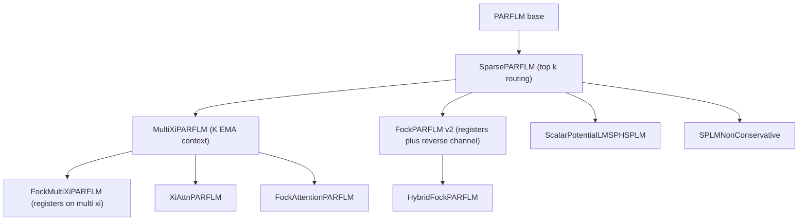
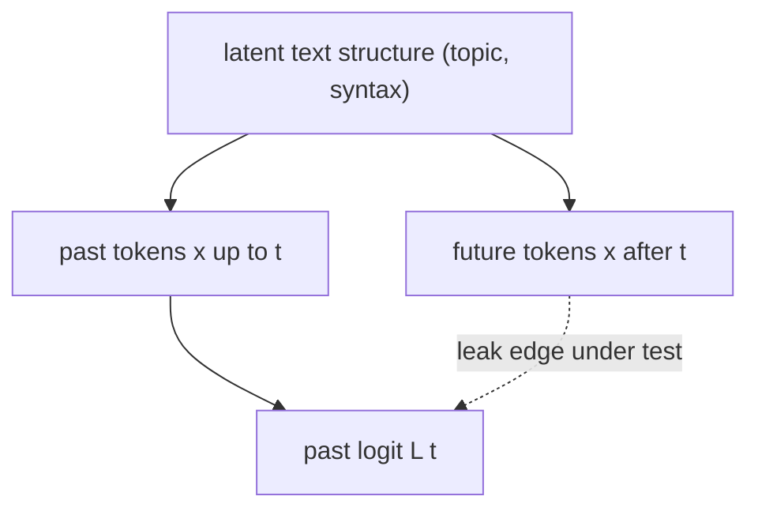
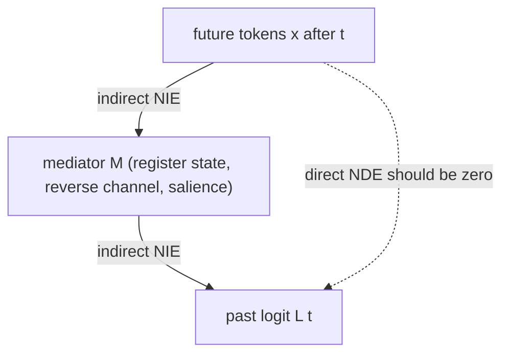
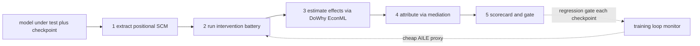
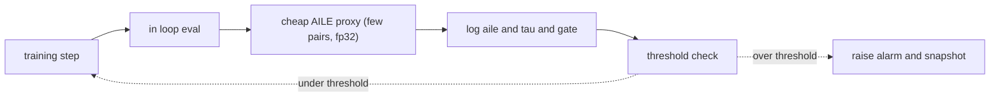

# SCAF — A Causal Auditing Framework for the SemSimula Model Family

**Purpose.** Turn the ad-hoc leak hunt of
[`Fock-PARFLM_Causal_Leak_Audit_Results.md`](https://github.com/dimitarpg13/semsimula-paper/blob/main/companion_notes/Fock-PARFLM_Causal_Leak_Audit_Results.md) into a reusable, semi-automated
**framework and open-source library** that audits *any* SemSimula-family model
for causal leaks arising from architectural deficiencies — before a checkpoint
is trusted, a comparison is drawn, or a paper is written.

**Proposed name.** SCAF — **S**emSimula **C**ausal **A**uditing **F**ramework
(package `scaf`). Designed for the SemSimula family first, but the abstractions
generalize to any force-based, state-space, or memory-augmented sequence model.

**Thesis.** The Fock-PARFLM leak was not a detection failure — the pathway was
found by hand. It was a **sizing** and **methodology** failure: the leak was
measured at initialization, with a probe design structurally blind to the
dominant (same-window) channel, and only a later trained-checkpoint,
target-relocation probe revealed a **33× perplexity inflation**. Those are
exactly the mistakes a *framework* prevents by encoding the hard-won protocol
once and applying it uniformly, reproducibly, and continuously. This document
argues the framework should be built **now**, sketches its causal-inference
foundations, and gives a concrete implementation plan on top of the PyWhy
stack (DoWhy, EconML, causal-learn).

**Last updated:** 23 July 2026.

---

## 1. Why a framework, and why now

### 1.1 The family is large and still growing

SemSimula is not one model; it is an inheritance tree of them, and every node
adds an architectural knob that is a fresh causal-leak surface.



Each subclass overrides `_layer_step` or the register lifecycle. The causal
guarantees live in shared machinery (strict pair masks, the source-detach that
severs Newton back-reaction, causal EMA weights, register geometry, the reverse
channel), but each override can silently break one of them. The Fock reverse
channel did. The next non-conservative variant, xi-attention head, or hybrid
integrator can too. **A one-off audit per model does not scale to a family that
gains a member every few weeks.**

### 1.2 The specific failure mode a framework removes

The prior audit teaches four lessons, each a design axiom below:

1. **Init-scale is worthless.** The leak grew by more than $10^6$ times in raw
   logit sensitivity during training; only a *trained-checkpoint* probe is
   trustworthy.
2. **Source-perturbation probes can be blind.** Perturbing future positions
   while measuring earlier targets never moves the measured target across the
   window boundary, so it misses the same-window / next-token copy that carried
   the bulk of the leak. A **target-relocation** protocol is mandatory.
3. **Correlation is not leak.** Future and past tokens are correlated in real
   text; only an *interventional* (do) measurement isolates the architectural
   channel.
4. **Effect size must be in task units.** A logit delta is not a perplexity;
   the number that mattered was +3.51 nats (33×), obtained by a confounder-
   adjusted paired comparison.

These are subtle, and they were learned the hard way. Left as folklore, they
will be re-forgotten. Encoded in a library, they are applied every time by
default.

### 1.3 The cost asymmetry

| Cost | When the leak is caught by SCAF | When it is caught after the fact |
|------|----------------------------------|-----------------------------------|
| Compute | minutes of CPU per checkpoint | 100k+ GPU-steps trained on a leaky objective |
| Science | a CI gate flips red | published PPLs and cross-model comparisons retracted |
| Effort | automatic scorecard | weeks of manual forensics (as just happened) |

Every result produced before the fix is now suspect and must be regenerated.
Building the auditor **before** the next wave of runs and papers is strictly
cheaper than repeating this episode per model.

### 1.4 Why existing causal-ML libraries are necessary but not sufficient

The PyWhy stack is excellent and SCAF builds on it — but it solves a different
problem. DoWhy/EconML assume **tabular observational data** and spend their
power on **identification under unobserved confounding** (backdoor, frontdoor,
IV). A neural simulator is the opposite regime: a **fully manipulable SCM**
where we can intervene on any variable, so identification is essentially free.
What is missing is the domain plumbing:

| Capability | DoWhy / EconML | causal-learn | Captum / TransformerLens / nnsight | LM eval harnesses | **SCAF** |
|------------|:--------------:|:------------:|:----------------------------------:|:-----------------:|:--------:|
| Formal estimand + refutation API | ✅ | — | — | — | wraps DoWhy |
| Heterogeneous effects (CATE) | ✅ | — | — | — | wraps EconML |
| Causal discovery of a DAG | — | ✅ | — | — | wraps causal-learn |
| Intervene on model internals | — | — | ✅ | — | ✅ |
| Positional / temporal SCM of a sequence model | — | — | — | — | ✅ |
| Sequence-aware leak measures (nats, PPL) | — | — | — | partial | ✅ |
| Target-relocation (honest-PPL) protocol | — | — | — | — | ✅ |
| Trained-checkpoint + continuous monitoring | — | — | — | — | ✅ |
| SemSimula family adapters (registers, reverse channel, xi, PARF) | — | — | — | — | ✅ |

SCAF is the thin, domain-specific layer that turns a SemSimula PyTorch model
into an intervenable SCM, generates the right probes, and hands the resulting
experiments to the PyWhy backends for estimation and refutation. Nobody will
build that generically; it must be built for this family, by this project.

---

## 2. Conceptual foundation

### 2.1 The model is a structural causal model you can fully manipulate

A SemSimula forward pass is a structural causal model (SCM). The exogenous
variables are the input tokens $x_0 \ldots x_{T-1}$ and the parameters
$\theta$. The endogenous variables are every activation — per position t, per
layer $\ell$: the token state, the register slot, salience, the reverse-channel
force, and finally the logits $L_t$. Each is assigned by a deterministic
structural equation (the layer step).

Two graphs matter:

- $G_{\text{spec}}$: the **intended** causal graph. For an autoregressive LM it
  is strictly triangular — node $(\ell, t)$ may depend only on nodes at
  positions $\le t$.
- $G_{\text{impl}}$: the **implemented** graph, i.e. the dependencies the code
  actually realizes.

A **causal leak** is any edge or path in $G_{\text{impl}}$ that violates the
temporal order of $G_{\text{spec}}$:

$$
\exists s \gt t : \quad \frac{\partial L_t}{\partial x_s} \neq 0 .
$$

Because the model is a fully manipulable simulator, we do not need
observational identification tricks: we can literally set any node to any value
and re-run. SCAF is therefore an engine for **in-silico randomized experiments**
on the model. The PyWhy backends contribute rigor in *estimation, uncertainty,
heterogeneity, mediation, and refutation* — not identification.

### 2.2 Observational association is not a leak; only intervention isolates it



In natural text, future tokens $x_{\gt t}$ are correlated with the past and
with the target $x_{t+1}$ through shared latent structure (the confounder).
An observational association between $x_{\gt t}$ and $L_t$ is therefore expected
and innocent. The leak is the **interventional** effect that survives when we
hold the past fixed and resample only the future:

$$
\text{do}\big(x_{\gt t} := \tilde x_{\gt t}\big), \qquad x_{\le t} \quad \text{held fixed}.
$$

Holding $x_{\le t}$ fixed is exactly backdoor adjustment for the confounder —
here achieved by construction rather than by statistical control, because we
own the data-generating process.

<p align="center"></p>

*Figure 1. Why SCAF is interventional, not observational. Freezing the causal
prefix and resampling only the future is a do-operation that removes the
confounding a purely correlational probe would mistake for a leak (or that
would mask a real one).*

### 2.3 Design axioms

| Axiom | Statement | Origin |
|-------|-----------|--------|
| A1 | Certify on **trained** checkpoints; monitor across training. | init-scale blindness |
| A2 | Use **target-relocation**, not only source-perturbation. | same-window blind probe |
| A3 | Measure **interventional** effects, not observational association. | confounding in text |
| A4 | Report effect sizes in **task units** (nats, PPL) with CIs. | logit delta ≠ PPL |
| A5 | **Attribute** the leak to components via mediation analysis. | reverse-channel locus |
| A6 | Establish a **bit-exact float64 determinism** baseline first. | "zero" must mean zero |
| A7 | Always run **positive and placebo controls** for probe power. | avoid false all-clear |

---

## 3. Causal measures

All measures are estimands SCAF exports to DoWhy; the definitions below are the
formal objects, the code in §5 estimates them.

### 3.1 Average Interventional Leak Effect (AILE)

For target position t, divergence $d$ (default: max-abs logit shift; task
variant: NLL of the true target), and future resampling distribution:

$$
\text{AILE}(t) = \mathbb{E}_{x,\tilde x}\Big[ d\big( L_t(x), L_t(\text{do}(x_{\gt t} := \tilde x_{\gt t})) \big) \Big] .
$$

A strictly causal model has $\text{AILE}(t) = 0$ for all t. SCAF reports the
per-position curve, its max, and a bootstrap CI. The **task-unit** form uses

$$
\Delta\mathrm{NLL}(t) = \mathbb{E}\big[ \mathrm{nll}_t(\text{do future}) - \mathrm{nll}_t(x) \big] ,
$$

directly comparable to the perplexity gap that needs explaining.

### 3.2 Honest-vs-standard perplexity as a confounder-adjusted estimand

Define a binary treatment on whether the target token is inside the model's
readable window:

$$
A \in \lbrace \text{in-window}, \text{out-of-window} \rbrace ,
$$

outcome = NLL of the **same** target token, confounder = left-context length /
in-window position. The honest-PPL protocol is the paired (matched) estimate of

$$
\tau_{\text{leak}} = \mathbb{E}\big[ \mathrm{nll}\mid A=\text{out} \big] - \mathbb{E}\big[ \mathrm{nll}\mid A=\text{in} \big] ,
$$

with the sign constraint that, for a causal model with **more** left context in
the out-of-window arm, $\tau_{\text{leak}} \le 0$ must hold. Observing
$\tau_{\text{leak}} \gg 0$ (the Fock result: +3.51 nats) certifies a leak and
quantifies it as a perplexity ratio $e^{\tau_{\text{leak}}}$.

### 3.3 Mediation: attributing the leak to a component



Decompose the total leak effect into a natural direct effect (NDE, through
edges that bypass the mediator) and a natural indirect effect (NIE, through the
mediator):

$$
\text{Total} = \text{NDE} + \text{NIE} .
$$

In SemSimula the direct token-to-token edges are provably absent (mask
geometry), so the leak is almost entirely NIE through the register / reverse-
channel mediator. SCAF confirms this operationally with the **controlled direct
effect** under a mediator knockout:

$$
\text{CDE}(M := m_0) = \mathbb{E}\big[ d\big( L_t(\text{do future}, \text{do } M{=}m_0), L_t(\text{do } M{=}m_0) \big) \big] ,
$$

where $m_0$ is the reference (e.g. reverse-channel gate set to zero). If
$\text{CDE}(M{:=}0) = 0$ while the total effect is large, the mediator M is the
locus. This is the formal version of `fock_leak_decompose.py`.

---

## 4. Framework architecture

SCAF is a five-stage pipeline plus a monitoring loop.



- **Stage 1 — Extract.** Instrument the model with hooks; build
  $G_{\text{impl}}$ over positional nodes; diff against $G_{\text{spec}}$.
  Static (module graph) plus optional empirical discovery (§5.4).
- **Stage 2 — Intervene.** Run the probe battery (§5.3): future perturbation,
  target relocation, mediator knockouts, precision sweeps, controls.
- **Stage 3 — Estimate.** Package each probe as a DoWhy estimand; estimate ATE
  and per-position CATE (EconML) with bootstrap CIs.
- **Stage 4 — Attribute.** Mediation (NDE/NIE) and CDE knockouts to localize
  the leak to a component.
- **Stage 5 — Report.** Emit a `LeakScorecard` (pass/fail per axiom, effect
  sizes, attributions, plots) and a CI exit code.
- **Monitor.** A cheap AILE proxy runs at each in-loop eval to catch a leak as
  the valve opens (§6).

---

## 5. Implementation sketch

All excerpts are illustrative Python for the `scaf` package. They productionize
the three prototype scripts already in the repo:

| Prototype (today) | SCAF component (proposed) |
|-------------------|---------------------------|
| `fock_causality_probe.py` | `scaf.probes.FuturePerturbationProbe` + controls |
| `fock_trained_leak_probe.py` (Part 1) | trained-scale AILE |
| `fock_trained_leak_probe.py` (Part 2) | `scaf.probes.TargetRelocationProbe` |
| `fock_leak_decompose.py` | `scaf.probes.MediationProbe` |

### 5.1 The intervenable model wrapper

The core abstraction is a wrapper that exposes do-operations on tokens,
positions, and named internal tensors via forward hooks — the bridge between the
PyTorch model and the SCM.

```python
# scaf/core/intervenable.py
import contextlib
import torch

class InterventableModel:
    """Wrap a SemSimula model as a manipulable SCM.

    Exposes do-operations on (a) input tokens, (b) named internal tensors
    registered by a family adapter (e.g. 'reverse_channel_scale',
    'register_state@layer3'). Interventions are scoped by a context manager
    so a single loaded checkpoint serves the whole probe battery.
    """

    def __init__(self, model, adapter, device="cpu"):
        self.model = model.eval()
        self.adapter = adapter          # knows the family-specific tensor names
        self.device = device
        self._edits = {}                # name -> callable(tensor) -> tensor
        self._handles = []
        for name, module in adapter.intervention_points(model):
            self._handles.append(
                module.register_forward_hook(self._make_hook(name))
            )

    def _make_hook(self, name):
        def hook(_module, _inp, out):
            fn = self._edits.get(name)
            return fn(out) if fn is not None else out
        return hook

    @contextlib.contextmanager
    def do(self, **edits):
        """do(reverse_channel_scale=lambda t: torch.zeros_like(t))."""
        prev, self._edits = self._edits, {**self._edits, **edits}
        try:
            yield self
        finally:
            self._edits = prev

    @torch.no_grad()
    def logits(self, tokens, float64=True):
        x = torch.as_tensor(tokens, device=self.device).long()[None]
        if float64:
            self.model.double()          # bit-exact determinism baseline (A6)
        return self.adapter.forward_logits(self.model, x).float().cpu()[0]
```

The `adapter` isolates everything family-specific (which modules to hook, how to
run a leak-free forward, where the reverse channel and registers live), so the
same probes run unchanged on every model in §1.1.

### 5.2 Lifting the module graph to a positional SCM

```python
# scaf/graph/scm.py
import networkx as nx

def positional_scm(adapter, T, L):
    """Build G_impl over nodes (layer, position) plus token and logit nodes,
    from the adapter's declared per-layer dependencies. Returns a DiGraph and
    the set of temporal-order-violating edges (candidate leaks)."""
    G = nx.DiGraph()
    for t in range(T):
        G.add_node(("x", t))
        G.add_node(("logit", t))
    for ell in range(L):
        for t in range(T):
            G.add_node((ell, t))
            for src in adapter.declared_sources(ell, t, T):   # (ell', t') deps
                G.add_edge(src, (ell, t))
    for t in range(T):
        G.add_edge((L - 1, t), ("logit", t))

    violations = [(u, v) for u, v in G.edges
                  if _pos(u) is not None and _pos(v) is not None
                  and _pos(u) > _pos(v)]          # source later than target
    return G, violations

def to_dowhy_gml(G):
    return "\n".join(f'{u} -> {v};' for u, v in G.edges)   # DoWhy graph string
```

`declared_sources` is the adapter's honest statement of intended dependencies;
`violations` is the static candidate-leak set. The empirical discovery in §5.4
cross-checks it against what the code actually does.

### 5.3 The probe battery

```python
# scaf/probes.py
import numpy as np, torch, torch.nn.functional as F
from dataclasses import dataclass

@dataclass
class ProbeResult:
    name: str
    per_position: np.ndarray     # AILE(t) or NLL(t)
    scalar: float                # headline effect size
    ci95: tuple                  # bootstrap CI
    unit: str                    # "logit" | "nats"

class FuturePerturbationProbe:
    """AILE (A3): freeze prefix, resample future, measure past logits/NLL."""
    def __init__(self, t_p, n_pairs=8, task_unit=True):
        self.t_p, self.n_pairs, self.task_unit = t_p, n_pairs, task_unit

    def run(self, im: "InterventableModel", corpus) -> ProbeResult:
        rng = np.random.default_rng(0); deltas = []
        for _ in range(self.n_pairs):
            x = corpus.window(); x2 = x.copy()
            x2[self.t_p:] = corpus.window()[self.t_p:]        # do(future)
            la, lc = im.logits(x), im.logits(x2)
            if self.task_unit:
                tgt = torch.as_tensor(x[1:self.t_p])
                d = (_nll(lc[:self.t_p-1], tgt) - _nll(la[:self.t_p-1], tgt))
            else:
                d = (la[:self.t_p] - lc[:self.t_p]).abs().amax(-1)
            deltas.append(d.numpy())
        arr = np.stack(deltas)
        return _summarize("future_perturbation", arr,
                          "nats" if self.task_unit else "logit")

class TargetRelocationProbe:
    """Honest-vs-standard PPL (A2, A4): score the SAME target in-window and
    out-of-window; the confounder (context length) is signed by monotonicity."""
    def run(self, im, corpus, k=1024, context=512) -> ProbeResult:
        half = context // 2; nll_A, nll_B = [], []
        for a in corpus.anchors(k, context):
            xA = corpus.slice(a - half, a - half + context)        # target IN
            nll_A.append(_nll_at(im.logits(xA), half - 1, xA[half]))
            xB = corpus.slice(a - context, a)                      # target OUT
            nll_B.append(_nll_at(im.logits(xB), -1, corpus[a]))
        diff = np.array(nll_B) - np.array(nll_A)                   # tau_leak
        return _summarize_scalar("target_relocation", diff, "nats")

class MediationProbe:
    """CDE via mediator knockout (A5): repeat AILE with a component clamped."""
    def __init__(self, mediator="reverse_channel_scale"):
        self.mediator = mediator
    def run(self, im, corpus, base_probe) -> dict:
        full = base_probe.run(im)
        with im.do(**{self.mediator: lambda t: torch.zeros_like(t)}):
            cde = base_probe.run(im)
        return {"total": full.scalar, "cde_knockout": cde.scalar,
                "attributed_to_mediator": full.scalar - cde.scalar}
```

Controls (A6, A7) are first-class probes too: `DeterminismControl`
(same input twice → 0), `PlaceboControl` (perturb positions that must not
matter → 0), `PositiveControl` (disable the known-causal source detach →
non-zero, proving probe power).

### 5.4 Empirical causal discovery — catching what static analysis misses

Static `declared_sources` reflects intent; learned routing (Gumbel top-k,
attention) can realize edges the author did not declare. SCAF cross-checks with
causal-learn on a perturbation-response matrix: perturb each position, record
which downstream logits move, and run a constraint-based discovery to recover
$G_{\text{impl}}$'s temporal-order violations automatically.

```python
# scaf/graph/discover.py
import numpy as np
from causallearn.search.ConstraintBased.PC import pc

def discover_violations(im, T, trials=256, eps=1e-9):
    R = np.zeros((T, T))                      # R[s, t] = |logit_t| moved by do(x_s)
    for _ in range(trials):
        x = _random_tokens(T); base = im.logits(x)
        for s in range(T):
            xs = x.copy(); xs[s] = _resample(x[s])
            moved = (im.logits(xs) - base).abs().amax(-1)
            R[s] += (moved > eps).numpy()
    # any mass at R[s, t] with s > t is a temporal-order violation (a leak edge)
    return [(s, t) for s in range(T) for t in range(s) if R[s, t] > 0]
```

This is the automated descendant of the manual static audit — the step that,
run routinely, would have flagged the reverse-channel edge without a human
reading every module.

### 5.5 Bridging to DoWhy and EconML

Each probe emits a tidy frame `(treatment, outcome, confounders, effect
modifiers)`; SCAF hands it to DoWhy for the model → identify → estimate →
refute workflow, and to EconML for per-position CATE (which positions and
token-types leak most).

```python
# scaf/estimate/pywhy.py
from dowhy import CausalModel

def estimate_leak(df, graph_gml):
    m = CausalModel(data=df, treatment="future_perturbed",
                    outcome="delta_nll", graph=graph_gml)
    est = m.identify_effect(proceed_when_unidentifiable=True)
    ate = m.estimate_effect(est, method_name="backdoor.linear_regression")
    # heterogeneity: does the leak depend on position? (EconML DML)
    cate = m.estimate_effect(
        est, method_name="backdoor.econml.dml.LinearDML",
        target_units=lambda d: d,                 # per-row CATE by position
        method_params={"init_params": {}},
    )
    # refutation: the state-of-the-art part we get for free
    refute = m.refute_estimate(est, ate,
                               method_name="placebo_treatment_refuter")
    return ate, cate, refute
```

The refutation suite is a genuine win: a placebo refuter (perturb positions
that must not matter) and a random-common-cause refuter give a standardized,
citable robustness check that the manual scripts approximated by hand.

### 5.6 Scorecard and CI gate

```python
# scaf/report.py
@dataclass
class LeakScorecard:
    determinism_ok: bool          # A6: baseline == 0 (bit-exact)
    positive_control_ok: bool     # A7: known leak detected
    placebo_ok: bool              # A7: no phantom leak
    aile_max_logit: float
    tau_leak_nats: float          # A4: honest-vs-standard gap
    ppl_inflation: float          # exp(tau_leak)
    mediator_attribution: dict    # A5: {component: fraction}
    def passed(self, tol_nats=0.02):
        return (self.determinism_ok and self.positive_control_ok
                and self.placebo_ok and abs(self.tau_leak_nats) < tol_nats)

def audit(model, adapter, corpus, checkpoint=None) -> LeakScorecard:
    ...   # runs stages 1-5; returns the scorecard; CLI maps passed() -> exit code
```

```bash
# CI usage — fail the build if a checkpoint leaks
scaf audit --model fock_multixi --ckpt step103500_best.pt \
           --corpus owt_val.npy --k 1024 --float64 --fail-on-leak
```

---

## 6. Continuous monitoring during training

The leak grew silently over 100k+ steps. SCAF's monitor runs a cheap AILE proxy
(a handful of window pairs, float32, one t_p) at each in-loop eval and logs
`aile_proxy`, `tau_leak_proxy`, and the reverse-gate magnitude, so the valve
opening is visible in real time and a threshold trips an alarm.

<p align="center"></p>

*Figure 2. Continuous auditing. A per-eval AILE proxy turns the post-hoc
forensic probe into a live gauge; when leak magnitude crosses the threshold the
run is flagged before more compute is spent on a leaky objective.*



---

## 7. Validation: the framework must re-find the known leak

A framework earns trust by reproducing the ground truth. SCAF's acceptance test
is the Fock-PARFLM case:

| Check | Expected on `step103500_best.pt` (legacy) | Expected on the prefix-causal fix |
|-------|-------------------------------------------|-----------------------------------|
| DeterminismControl | 0.0 (bit-exact) | 0.0 |
| PositiveControl (detach off) | non-zero | non-zero |
| PlaceboControl | 0.0 | 0.0 |
| AILE max (trained scale) | ~37 logit units | 0.0 |
| TargetRelocation `tau_leak` | +3.51 nats (33×) | ~0 nats |
| MediationProbe attribution | ~100% to reverse channel | n/a (no leak) |

Passing this table on the legacy checkpoint (leak found, sized, attributed) and
on the fixed checkpoint (all-clear) is the library's first regression suite.

---

## 8. Roadmap and package layout

```text
scaf/
  core/        intervenable.py   adapters/{parf,fock,xiattn,sphsplm,noncons}.py
  graph/       scm.py  discover.py
  probes.py    controls.py
  estimate/    pywhy.py  cate.py
  report.py    monitor.py  cli.py
  tests/       test_fock_regression.py   (the §7 table)
```

- **Milestone 0 (1–2 days).** Refactor the three prototype scripts behind the
  `probes` API + `FockAdapter`; reproduce the §7 legacy/fixed table. Immediate
  value, no new theory.
- **Milestone 1.** Add `TargetRelocationProbe`, controls, `LeakScorecard`, CLI,
  CI gate; wire the training-loop monitor (§6).
- **Milestone 2.** DoWhy/EconML bridge (§5.5) for CATE-by-position and
  refutation; positional SCM extraction + static violation set (§5.2).
- **Milestone 3.** Empirical discovery via causal-learn (§5.4); adapters for the
  rest of the family (§1.1); publish as an installable package with the Fock
  case as the worked example and citable audit protocol.

---

## 9. Related work and the gap

- **PyWhy (DoWhy, EconML).** The four-verb engine (model, identify, estimate,
  refute), CATE, and mediation (NDE/NIE). SCAF consumes it for estimation and
  refutation; it does not address model-internal interventions, positional
  SCMs, or sequence-aware measures.
- **causal-learn.** Constraint- and score-based discovery (PC, GES). SCAF uses
  it to recover $G_{\text{impl}}$ from perturbation-response data.
- **Ananke / pgmpy.** ADMG identification and PGM tooling — useful if latent
  confounding is ever introduced deliberately (e.g. stochastic routing).
- **Captum / TransformerLens / nnsight.** Activation interventions and
  attribution for interpretability. They provide the *mechanism* of intervening
  on internals but not the *causal-inference formalism* (estimands, refutation,
  mediation) or the leak-specific protocols. SCAF sits at this intersection.
- **LM eval harnesses.** Compute perplexity but assume the scoring protocol is
  trustworthy — the very assumption the Fock leak violated.

The gap SCAF fills: **a causal-inference-grade auditor that intervenes on the
internals of a manipulable sequence-model SCM, uses sequence-aware,
task-unit measures, applies the target-relocation and trained-checkpoint
protocols by default, attributes leaks to components, and gates CI — for the
SemSimula family first.**

---

## Appendix A — estimand cheat-sheet

| SCAF probe | DoWhy verb chain | Estimand | SemSimula instance |
|------------|------------------|----------|--------------------|
| FuturePerturbation | model → identify → estimate | ATE of `do(future)` on past logit/NLL | reverse-channel AILE |
| TargetRelocation | model (paired) → estimate | confounder-adjusted `tau_leak` | honest-vs-standard PPL |
| Mediation | identify (NDE/NIE) → estimate | CDE under mediator knockout | reverse-channel attribution |
| Discovery | causal-learn PC | edges of `G_impl` | recover the leak edge |
| Controls | refute | placebo / positive-control | probe-power certification |

## Appendix B — glossary

- **AILE** — Average Interventional Leak Effect (§3.1).
- **CDE / NDE / NIE** — controlled / natural direct / natural indirect effect.
- **`tau_leak`** — honest-minus-standard NLL gap; `exp(tau_leak)` is the PPL
  inflation factor.
- **`G_spec` / `G_impl`** — intended vs implemented causal graph.
- **Target relocation** — scoring the same token inside vs outside the readable
  window to expose same-window leaks (the protocol the first audit lacked).
- **Adapter** — the family-specific plug that tells SCAF where a model's
  intervention points and leak-free forward live.

## Appendix C — companion documents

- [`Fock-PARFLM_Causal_Leak_Audit_Results.md`](https://github.com/dimitarpg13/semsimula-paper/blob/main/companion_notes/Fock-PARFLM_Causal_Leak_Audit_Results.md) — the case study SCAF generalizes.
- [`GitHub_Markdown_LaTeX_Rendering_Cheatsheet.md`](https://github.com/dimitarpg13/semsimula-paper/blob/main/companion_notes/GitHub_Markdown_LaTeX_Rendering_Cheatsheet.md) — rendering rules used here.
- Prototype scripts: [`notebooks/conservative_arch/scaleup/debug/`](https://github.com/dimitarpg13/semsimula-paper/tree/main/notebooks/conservative_arch/scaleup/debug)
  ([`fock_causality_probe.py`](https://github.com/dimitarpg13/semsimula-paper/blob/main/notebooks/conservative_arch/scaleup/debug/fock_causality_probe.py),
  [`fock_trained_leak_probe.py`](https://github.com/dimitarpg13/semsimula-paper/blob/main/notebooks/conservative_arch/scaleup/debug/fock_trained_leak_probe.py),
  [`fock_leak_decompose.py`](https://github.com/dimitarpg13/semsimula-paper/blob/main/notebooks/conservative_arch/scaleup/debug/fock_leak_decompose.py)).
