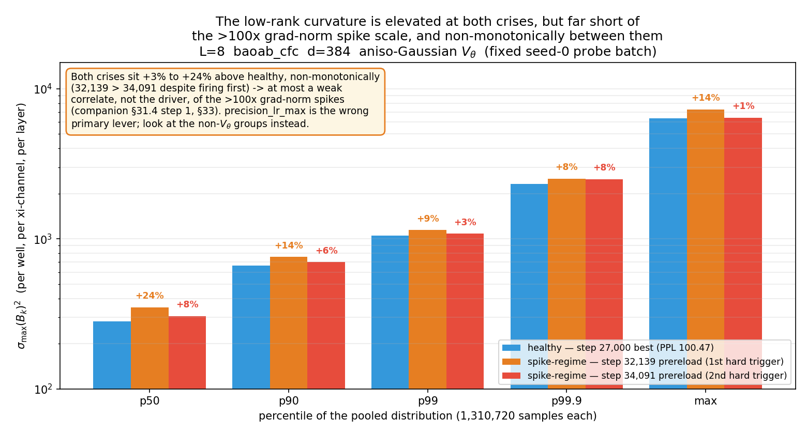
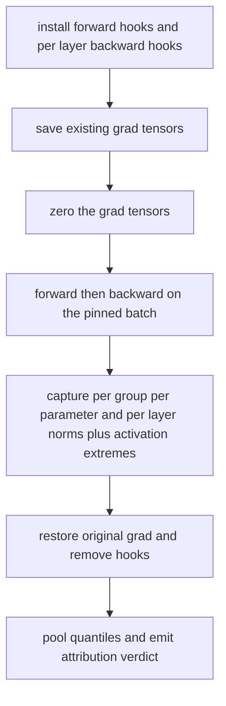
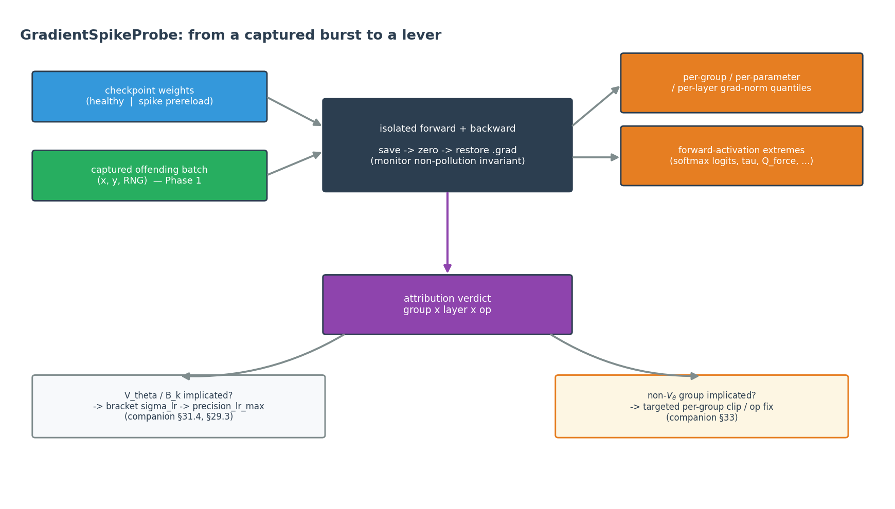
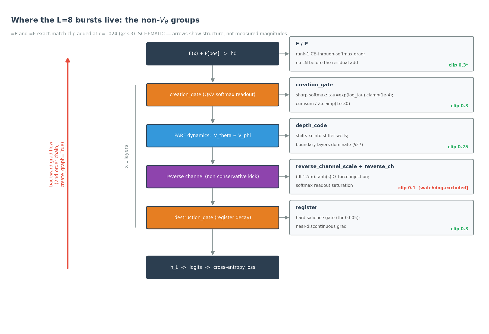

# Gradient-Spike Attribution for Fock-PARFLM: Requirements, Parameters, and a SCAF Probe Design

**Status:** design only. Nothing in this document has shipped yet. It
specifies a new probe, `scaf.GradientSpikeProbe`, on the `spike_diagnostic`
branch (cloned from `stiffness_audit`). Unlike every probe currently in SCAF,
this one is **backward-aware** — it runs a real `.backward()` — so §7 spends
most of its length on the one invariant that makes that safe. The companion
notebook-side workflow (Phase 0 log-mining, Phase 1 batch capture) that feeds
this probe is described in §6; it is what turns a watchdog reload into a
reproducible experiment.

**Companion:**
[`Stiffness_Audit_Requirements_and_Design.md`](Stiffness_Audit_Requirements_and_Design.md)
(the sibling Tier-C diagnostic this one complements — stiffness is
forward-only and $V_\theta$-curvature-specific; this probe is backward-aware
and group-agnostic),
[`docs/model-interface-design.md`](model-interface-design.md) (the adapter
contract this design extends with two small additions, §5.2),
[`CfC_BAOAB_Integrator_and_Mitigations.md` §33](https://github.com/dimitarpg13/semsimula-paper/blob/main/companion_notes/CfC_BAOAB_Integrator_and_Mitigations.md)
(the empirical result that motivated this probe: the `precision_lr_max`
bracket came back modestly and non-monotonically elevated but far too small
in magnitude to explain the spikes, so they are not primarily a
$V_\theta$-curvature problem).

---

## 1. The one sentence that decides everything

The stiffness audit asks *"is any token in a well too sharp for the
integrator's step?"* — a question about $V_\theta$. This probe asks a
different one: **when the gradient norm spikes, which parameter group, which
layer, and which op is actually responsible — and is it the same one every
time?**

That question cannot be answered by the scalar `grad_norm` the watchdog
thresholds on, nor by the stiffness audit (which never runs a backward pass),
nor — as §2 shows — by inspecting weights statically. It needs one real
backward pass on the *specific* batch that caused a *specific* spike, with
per-group, per-parameter, and per-layer gradient norms and the forward
activations that fed them, all captured together.

---

## 2. Background: why the existing tooling cannot attribute a spike

Three tools already exist and each stops short of attribution:

1. **The training-loop per-group log.** Cell 6 computes pre-clip group norms
   (`per_group_grad_norms`) and, with `GRAD_SPIKE_DEBUG=True`, writes an
   `event: grad_spike` record with the top-8 groups to
   `training_log.jsonl`. This is real and useful (§6, Phase 0) but coarse: it
   is per-*group*, not per-parameter or per-layer, and it records the batch
   *index* but not the batch *contents*, so a spike cannot be replayed.
2. **The watchdog aggregate is filtered.** The scalar it thresholds on is
   $\sqrt{\sum_k \mathrm{gn}_k^2}$ over groups **excluding**
   `reverse_channel_scale` and `reverse_ch`. If the reverse channel is the
   instigator, the aggregate under-reports it, and the hard trigger only fires
   once the disturbance bleeds into an included group. Any attribution built
   on the aggregate alone is therefore biased away from the very channel most
   likely to be non-conservative.
3. **`StiffnessProbe` is forward-only and $V_\theta$-specific.** It measures
   $\omega \Delta t$ from the $V_\theta$ harmonic linearisation and the
   `sigma_lr_*` percentiles of $\sigma_{\max}(B_k)^2$. That is exactly the
   right tool when the suspect is $V_\theta$ curvature — but on the live L=8
   `baoab_cfc` d=384 run it returned a **negative** result for $B_k$ as the
   *primary* driver:

> The `precision_lr_max` bracket (healthy step-27,000 checkpoint vs. both
> spike-regime prereload snapshots, step 32,139 and step 34,091) came back
> +1% to +24% above healthy at every percentile — real and repeatable, but
> non-monotonic between the two triggers (32,139 is *more* elevated than
> 34,091, despite firing first) and far too small to explain pre-clip
> grad-norms of 701.1 and 5,864.9 (both an order of magnitude or more above
> the `GRAD_NORM_HARD_TRIGGER=500.0` threshold) via a $\lesssim 1.1\times$
> frequency effect. $B_k$ growth is at most a weak correlate, not the
> driver, of these bursts; the spikes live in the non-$V_\theta$ groups.
> (CfC/BAOAB companion note §33.1.)

<p align="center"></p>

That modest-but-non-escalating result is the motivation for this probe.
`StiffnessProbe` could rule $V_\theta$ *out* as the primary driver; nothing
in SCAF can currently point at what is *in*. The
crucial fact `StiffnessProbe` also surfaces — that $B_k$ is context-dependent,
so a static weight inspection undersells what the *actual* offending batch
does — is exactly why this probe is built around a captured batch and a real
backward pass rather than around the weights alone.

---

## 3. What the probe measures, precisely

Given a frozen checkpoint and **a specific batch** (either a captured
offending batch, §6, or a corpus sample), the probe:

1. Loads the weights into an `InterventableModel`, installs forward hooks on
   the adapter-declared risky-activation points (§5.2), and installs
   `register_full_backward_hook`s on the per-layer modules.
2. Saves any pre-existing `.grad` tensors, zeroes them, and runs one
   forward + `loss.backward()` on the batch (§7 — the non-pollution
   invariant).
3. Records, from that single backward:
   - **per-group** gradient L2 norms, grouped by the same
     `_assign_clip_group` logic the training loop uses (so the numbers line
     up with `training_log.jsonl`);
   - **per-parameter** gradient norms (finer than groups — pinpoints the
     exact tensor, e.g. `creation_gate_qkv.log_tau` vs. `W_Q`);
   - **per-layer** gradient norms from the backward hooks (localises *which*
     of the $L$ layers the spike originates at);
   - **forward-activation extremes** at the risky ops (softmax logits, the
     temperature $\tau$, the reverse-channel $Q_{\mathrm{force}}$, the register
     salience, the depth-code-shifted xi magnitude, the $V_\theta$
     quadratic-form exponent).
4. Restores the original `.grad` tensors and removes all hooks (§7).
5. Pools and reports quantiles (reusing `stiffness.py`'s `_quantiles`) plus a
   headline attribution.

As a control flow, the run is a straight line with a guaranteed restore step:



It is a **read-only-of-weights, write-only-to-a-scratch-graph diagnostic**: it
does not step the optimizer, does not change the checkpoint, and leaves the
model's `.grad` state exactly as it found it.

<p align="center"></p>

---

## 4. What it does not do

- It does not decide *why* an op is pathological — it localises the op and
  reports the activation extreme; the mechanism (e.g. "temperature collapsed,
  softmax Jacobian blew up") is read off the numbers by the analyst.
- It does not run inside the training loop by default (§8 discusses the
  offline-vs-live trade-off). The default mode is a post-hoc replay of a
  captured spike, which is deterministic and repeatable; a live per-step mode
  is an opt-in described in §8 but is not the recommended first use.
- It does not attribute across batches. One probe run is one (weights, batch)
  pair. Comparing a healthy batch to an offending batch is two runs, exactly
  as the stiffness `sigma_lr` bracketing is two checkpoints.

---

## 5. Requirements

### 5.1 Inputs

| Input | Source | Notes |
| --- | --- | --- |
| checkpoint weights | `_best.pt` / `_prereload.pt` | loaded into an already-built `nn.Module`, per the SCAF boundary (adapters never reconstruct from a raw dict) |
| the batch | captured offending batch (§6, Phase 1) or `corpus.sample()` | the offending batch is what makes the burst reproducible; a corpus sample only measures typical behaviour |
| the loss | the model's own `model(x, y) -> (logits, loss)` | the probe differentiates the training loss, not a surrogate, so the attribution matches training |

The captured-batch path is the point of the probe. A corpus sample reproduces
the §2 limitation (it measures the weights' *typical* behaviour, which for
$B_k$ was only modestly and non-monotonically elevated); the offending batch
reproduces the *event*.

### 5.2 Adapter contract additions

Two small, structural additions to the adapter (`docs/model-interface-design.md`),
both checked structurally and skipped-loudly if absent, never guessed from a
name:

```python
class ModelAdapter:
    def parameter_groups(self, model) -> dict[str, list[str]]:
        """Map a group key -> the parameter names in it, using the SAME
        grouping the training loop clips by (creation_gate, register,
        reverse_channel_scale, depth_code, E, P, V_theta, V_phi, ...).
        Lets the probe's per-group numbers line up 1:1 with
        training_log.jsonl's grad_spike records."""

    def risky_activation_points(self, model) -> list[tuple[str, nn.Module]]:
        """Named submodules whose forward output should be captured for
        extreme-value reporting: the creation/reverse softmax readouts, the
        register salience gate, the depth-code shift, the V_theta well
        evaluation. Reuses intervention_points()' discovery machinery."""
```

`parameter_groups` is a thin wrapper over the same substring/exact-match
logic `_assign_clip_group` already encodes; `risky_activation_points` reuses
the forward-hook discovery `InterventableModel` already performs for
`intervention_points`. Neither adds a new hook *mechanism* — only a new list
of targets.

The groups and ops these two methods expose are exactly the spike-bearing
stages of the Fock-PARFLM forward pass, together with the per-group clip
ceilings and the watchdog-exclusion of the reverse-channel groups the probe
must account for (§2, §12):

<p align="center"></p>

### 5.3 Capability gating

A new capability flag, set by the adapter, gates the probe so it skips loudly
(never crashes, never returns a wrong number) on a model that cannot support
it:

| Capability | Required for | On absence |
| --- | --- | --- |
| `has_parameter_groups` | per-group attribution | skip with a reason |
| `has_risky_activation_points` | activation-extreme reporting | run grad-only, note the omission in `detail` |
| model exposes `(logits, loss)` | the backward pass | skip with a reason |

---

## 6. The training-loop side: Phase 0 and Phase 1

The probe consumes two things the training loop must produce. These are
paper-repo-side (they import the model and the training loop), exactly as the
stiffness audit's checkpoint reconstruction stays notebook-side.

**Phase 0 — mine what is already logged (no code change).** `training_log.jsonl`
already carries `grad_spike` and watchdog records. A small analysis cell
builds the per-group time series and the spike table; this alone answers
"which group leads, and always the same one?" and is the cheapest first step.
The one correction it must apply is the watchdog-exclusion bias of §2 item 2:
read `_last_pg_norms`, not the aggregate.

**Phase 1 — capture the offending batch (small patch).** The `_prereload`
snapshot preserves the weights at the crisis but not the token batch. Extend
`_reload_best` so that, alongside the `_prereload` weights, it serialises the
offending `(x, y)` ids and the RNG state to a sidecar file:

```python
def _reload_best(pre_reload_step=None):
    if pre_reload_step is not None and PRERELOAD_SNAPSHOT_MAX_KEEP > 0:
        save_checkpoint(pre_reload_step, float('nan'), tag_suffix='_prereload')
        # NEW: pin the batch + RNG that produced the spike, so the crisis
        # forward+backward is deterministically replayable by the probe.
        torch.save(
            {'x': xb.detach().cpu(), 'y': yb.detach().cpu(),
             'rng_state': torch.get_rng_state(), 'step': pre_reload_step},
            CKPT_DIR / f'{CKPT_PREFIX}_step{pre_reload_step}_spikebatch.pt',
        )
    ...
```

With the pair **(weights just before the bad step, exact batch)** the crisis
is reproducible — which the §2 fixed-seed probe was not.

---

## 7. The one invariant: probing must not pollute training `.grad`

SCAF's monitor test suite already enforces that probing a model mid-training
must not disturb the gradients the training loop is accumulating:

```python
# tests/test_monitor.py::test_no_gradients_are_accumulated
model(torch.zeros(1, 8, dtype=torch.long))[0].sum().backward()
before = {n: p.grad.clone() for n, p in model.named_parameters()}
monitor(model).run(0)
for n, p in model.named_parameters():
    assert torch.equal(p.grad, before[n]), n
```

Every existing probe satisfies this trivially because none of them call
`.backward()`. This probe does, so it must satisfy the invariant explicitly.
The pattern:

```python
def _isolated_backward(self, model, x, y):
    saved = {n: (p.grad.detach().clone() if p.grad is not None else None)
             for n, p in model.named_parameters()}
    model.zero_grad(set_to_none=True)
    try:
        _, loss = model(x, y)
        loss.backward()
        grads = {n: (p.grad.detach().clone() if p.grad is not None else None)
                 for n, p in model.named_parameters()}
    finally:
        # restore EXACTLY what training had accumulated, byte for byte
        for n, p in model.named_parameters():
            p.grad = None if saved[n] is None else saved[n]
    return grads
```

The captured `grads` dict — not the live `.grad` tensors — is what the probe
aggregates, so the restore step is unconditional (it runs even if `backward()`
throws). This is the single most important correctness property of the probe,
and §9's test suite asserts it directly against the same fixture
`test_no_gradients_are_accumulated` uses.

---

## 8. Design decisions and alternatives

**Offline replay is the default; live per-step is opt-in.** The recommended
mode is post-hoc: point the probe at a captured (weights, batch) pair and
replay. This is deterministic, repeatable, and cannot slow or destabilise a
training run. A live mode — run the probe every $N$ steps, or automatically on
a detected spike — is possible (the invariant of §7 makes it *safe*), but it
doubles the backward cost on the steps it fires and is only worth it once the
offline workflow has identified what to watch. Offline first.

**Forward hooks + one explicit backward, not backward hooks alone.** The
per-layer localisation uses `register_full_backward_hook`, but the activation
extremes use forward hooks, because the pathology is usually a forward
quantity (a collapsed temperature, a saturated softmax) that *causes* the
large backward. Capturing both in the same pass lets the report line up "this
activation was extreme" with "this layer's gradient was large."

**Per-group grouping mirrors the training loop, deliberately.** The probe uses
the adapter's `parameter_groups` (§5.2), which wraps the same
`_assign_clip_group` the loop clips by, so the probe's per-group numbers are
directly comparable to `training_log.jsonl`. A different grouping would be
more "natural" for a general library but would break that 1:1 correspondence,
which is the whole point during a live investigation.

**Attribution, not a pass/fail verdict.** Unlike leak probes (which have a
principled zero-threshold) or the stiffness probe (which has the
$\omega \Delta t \lt 2$ bound), a gradient spike has no universal "correct"
value. So `statistic` is the headline group's share of the total gradient
norm, `unit` is `"grad_frac"`, and `passed` is left `None` (descriptive) by
default — the probe *attributes*, it does not *judge*. A threshold mode
(e.g. flag when one group exceeds a fraction) is available for the live use
case but off by default.

---

## 9. Interface and result

Follows the established `Probe.run(im, corpus) -> ProbeResult` contract, with a
captured-batch override:

```python
class GradientSpikeProbe(Probe):
    name = "gradient_spike"

    def __init__(self, batch=None, n_batches=1, seqs_per_batch=2,
                 top_k_groups=8, flag_group_frac=None):
        ...

    def run(self, im, corpus) -> ProbeResult:
        if not im.caps.has_parameter_groups:
            return self._skip("adapter exposes no parameter_groups()")
        x, y = self._resolve_batch(im, corpus)   # captured batch or sample
        grads = self._isolated_backward(im.model, x, y)   # §7
        # ... group / parameter / layer norms + activation extremes ...
        return ProbeResult(
            name=self.name,
            statistic=lead_group_frac,      # headline group's share
            unit="grad_frac",
            threshold=self.flag_group_frac, # None -> descriptive
            passed=None if self.flag_group_frac is None
                   else lead_group_frac <= self.flag_group_frac,
            detail={
                "lead_group": lead_group,
                "lead_layer": lead_layer,
                "group_norms": {...},        # per-group
                "top_params": {...},         # per-parameter, top_k
                "layer_p50": ..., "layer_p99": ..., "layer_max": ...,
                "act_extremes": {...},       # per risky op
                "n_samples": ...,
            },
        )
```

The `detail` dict reuses `stiffness.py`'s `_quantiles` for the per-layer and
per-parameter distributions, and its `to_dict()` flattening (via `ProbeResult`)
makes every field land in the JSONL scorecard log unchanged.

---

## 10. Testing plan

Follows `tests/test_stiffness_probe.py` conventions (toy models with a *known*
answer, grouped test classes, exact `pytest.approx` assertions):

- **`test_restores_training_grads`** — the §7 invariant, against the same
  fixture as `test_no_gradients_are_accumulated`: accumulate grads, run the
  probe, assert every `.grad` is byte-identical afterwards (including the
  throw path — inject a failing loss and assert restore still happened).
- **`test_attributes_planted_spike`** — a toy model with a deliberately
  near-degenerate softmax temperature in one named module; assert
  `detail["lead_group"]` and `detail["lead_layer"]` point at it, and
  `detail["act_extremes"]` shows the collapsed temperature.
- **`test_skips_loudly_without_parameter_groups`** — a plain toy LM whose
  adapter has no `parameter_groups`; assert `result.skipped` and a reason.
- **`test_captured_batch_overrides_corpus`** — pass an explicit batch; assert
  the corpus is not sampled and the pinned batch is what gets differentiated.
- **Helper units** — `_isolated_backward` and the grouping map tested
  independently of the probe class, as `_quantiles`/`weyl_upper_bound` are.

---

## 11. Standalone usage

```python
import scaf, torch

spike = torch.load("..._step34091_spikebatch.pt")  # Phase 1 capture

with scaf.InterventableModel(model, device=DEVICE, dtype="float32") as im:
    if im.caps.has_parameter_groups:
        res = scaf.GradientSpikeProbe(batch=(spike["x"], spike["y"])).run(im, corpus)
        print(res)
        if not res.skipped:
            print(f"  lead group : {res.detail['lead_group']} "
                  f"({res.statistic:.1%} of total grad)")
            print(f"  lead layer : {res.detail['lead_layer']}")
            print(f"  act extremes: {res.detail['act_extremes']}")
    else:
        print("SKIPPED -- adapter exposes no parameter_groups()")
```

Running it on the healthy `_best.pt` and on the `_prereload.pt` with the same
captured batch is the attribution analogue of the stiffness `sigma_lr`
bracketing: the difference between the two localises what changed at the spike.

---

## 12. Open follow-ups

- **Which layer numbering.** The per-layer hooks report in module order; if
  the adapter's layer list and the integrator's depth index disagree (they do
  not today, but could under layer-checkpointing), the mapping needs an
  adapter method rather than an assumption.
- **Reverse-channel de-biasing surfaced explicitly.** Because the watchdog
  aggregate excludes the reverse-channel groups (§2), the probe should mark in
  `detail` whether the lead group is one of the excluded ones — that single
  boolean is often the most actionable output, since it says "the watchdog was
  blind to this."
- **Live auto-fire mode.** The safe-by-§7 live mode is specified but not part
  of the first cut; add it only once the offline workflow has been used on a
  real capture and shown what threshold is worth firing on.
- **Cross-checkpoint diff helper.** A thin wrapper that runs the probe on two
  checkpoints with one pinned batch and diffs the `detail` dicts — the
  attribution analogue of the stiffness bracketing table — is worth adding
  once there is a second caller.

---

*Design note for `semsimula-scaf`, branch `spike_diagnostic`. The empirical
result motivating it is in the paper repo's
`companion_notes/CfC_BAOAB_Integrator_and_Mitigations.md` §33; the parameter
groups and risky ops it attributes over are those of `FockMultiXiPARFLM`
(`notebooks/conservative_arch/parf/model_fock_parf_multixi.py`) and the
anisotropic Gaussian $V_\theta$
(`notebooks/conservative_arch/parf/model_aniso_gaussian_vtheta.py`). Figures
generated by `docs/images/_make_spike_diagnostic_figures.py`.*
