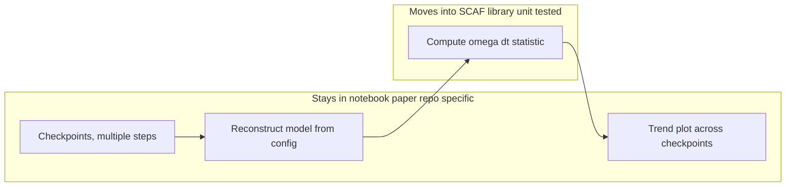

# Stiffness Audit for Fock-PARFLM Checkpoints: Requirements, Parameters, and a SCAF Migration Design

**Status:** design document. The statistic described here runs today as
notebook-only cells in `scaf_checkpoint_analysis.ipynb`; nothing in this
document is implemented inside `src/scaf/` yet. See §9 for why, and §10 for
what migrating it would look like.

**Companion:**
[`notebooks/conservative_arch/scaleup/debug/scaf_checkpoint_analysis.ipynb`](https://github.com/dimitarpg13/semsimula-paper/blob/main/notebooks/conservative_arch/scaleup/debug/scaf_checkpoint_analysis.ipynb)
(Phase 7, the current implementation),
[`docs/BAOAB/PyTorch_Implementation_of_CfC_BAOAB_in_Fock-PARFLM.md`](https://github.com/dimitarpg13/semantic_simulation/blob/main/docs/BAOAB/PyTorch_Implementation_of_CfC_BAOAB_in_Fock-PARFLM.md)
sec. 4.1 (derivation of the stability bound this audit tests),
[`docs/model-interface-design.md`](model-interface-design.md) (the adapter
contract this design extends).

---

## 1. The one sentence that decides everything

The audit answers a single question against a frozen checkpoint: **at this
point in training, is any token sitting in a well sharp enough that the
integrator's own step size would make that step unstable?**

That question has a closed-form answer for every $V_\theta$ family that
exposes a harmonic linearisation of its force (§3, §4.2), and it can be asked
retroactively against a checkpoint that already exists — it needs no
retraining and no gradient-norm log. It does not need the checkpoint to have
trained with CfC/BAOAB specifically, but *which* integrator it forces on for
the duration of the probe does change which hidden states get measured for
any checkpoint deeper than one layer — see §4.4.

---

## 2. Background: the bound this audit tests

Velocity-Verlet advances a hidden state $h$ under a harmonic restoring force
$F(h) = -K(h - h^\ast)$ with per-layer mass $\mathfrak{m}$ and step $\Delta t$.
Writing $\omega = \sqrt{K/\mathfrak{m}}$ for the local oscillation frequency,
the discrete update is stable if and only if

$$
\omega \Delta t \lt 2.
$$

Full derivation, companion-matrix eigenvalues, and the unit-circle argument
live in the PyTorch implementation deep dive linked above (sec. 4.1); this
document only needs the bound itself; and one empirical fact:

> **The bound was not checked before OpenWebText training, and it was
> crossed repeatedly.** The ground-truth `training_log.jsonl` for the OWT
> aniso-Gaussian, `gamma_train=0.10`, Verlet run shows 15 watchdog reloads
> between step 8925 and step 16824, with `ema_grad_norm` climbing from about
> 115 at the first reload to about 285 at the worst one. Every one of those
> reloads is a symptom the stiffness audit is designed to diagnose directly,
> instead of inferring it after the fact from a gradient-norm spike.

The audit turns that empirical fact into a per-checkpoint, per-position
measurement: instead of asking "did the gradient explode," it asks "was
$\omega \Delta t$ already past 2 at the positions and steps where training
later reloaded."

---

## 3. What the audit measures, precisely

For a frozen checkpoint and a batch of real validation tokens, the audit:

1. Runs one forward pass with the harmonic linearisation of $V_\theta$
   forced on, by default regardless of which integrator the checkpoint
   actually trained under (§4.4 explains the trade-off this makes, and the
   alternative that avoids it).
2. At every layer, evaluates the diagonal curvature $K(h)$ — the code
   identifier for this quantity is `k_diag` — and the mass $\mathfrak{m}$
   the model already computes for its own dynamics (`compute_mass`).
3. Forms $\omega(h) = \sqrt{K(h)/\mathfrak{m}}$ and multiplies by the
   checkpoint's own $\Delta t$ (`model_cfg.dt`) to get a per-position,
   per-dimension sample of $\omega \Delta t$.
4. Pools those samples across every token, layer, and hidden dimension in
   the batch(es) and reports quantiles, a marginal-instability fraction, an
   unstable fraction, and the maximum.

It is a **read-only, retrospective diagnostic**. It does not retrain, does
not change the checkpoint's weights, and restores the model's original
integrator configuration when it finishes (or throws) — the harmonic
linearisation is switched on only for the duration of the probed forward
passes.

---

## 4. Requirements

### 4.1 Checkpoint schema

The audit needs **multiple checkpoints from the same run at different
steps**, not a single `ckpt_best.pt`. One checkpoint is one point; a trend
needs several. Two schemas are supported, both produced by existing
production notebooks:

| Schema | Carries | Produced by |
| --- | --- | --- |
| `model_cfg` schema | `ckpt['model_cfg']`, `ckpt['step']` | the OWT production notebooks (`colab_fock_aniso_gaussian_fockreg_openwebtext.ipynb`, the CfC/BAOAB variant) |
| `recipe` schema | `ckpt['recipe']`, `ckpt['cell']` | `colab_fock_multixi_structured_vtheta.ipynb` (SQ1-4 structured `V_theta` recipes and the MLP baseline) |

Reconstruction tries the `model_cfg` path first and falls back to the
`recipe` path on a `no model_cfg` error, so a mixed list of checkpoints from
different notebooks is fine as long as each individual path is one of the
two schemas above.

### 4.2 $V_\theta$ family: `harmonic_terms()`

The audit is only as good as the closed-form curvature the $V_\theta$
family can expose. Every family is checked structurally (never guessed from
a name string) and the audit skips loudly, per checkpoint, rather than
silently substituting a value it cannot justify:

| `V_theta` family | Has `harmonic_terms()` | Exactness |
| --- | --- | --- |
| Plain MLP (`ScalarPotentialMultiXi`) | No | not applicable — no closed-form curvature |
| Isotropic Gaussian (`MixtureGaussianVTheta` and depth-conditioned wrapper) | Yes | exact — no low-rank term to approximate |
| Anisotropic Gaussian (`AnisotropicMixtureGaussianVTheta` and depth-conditioned wrapper) | Yes | exact for the diagonal precision part; the low-rank correction contributes a residual that is not captured |
| SQ3 mixture quadratic (`MixtureQuadraticVTheta`) | Yes | exact — same softmax-of-linear-springs structure as the Gaussian mixtures |
| SQ2 low-rank quadratic (`LowRankQuadraticVTheta`) | Yes | diagonal approximation; residual is the off-diagonal low-rank coupling |
| SQ4 hybrid quadratic plus MLP residual (`HybridQuadraticVTheta`) | Yes | backbone only — the MLP residual has no closed form, so the reading is a lower bound on the true curvature, not a ceiling |

A checkpoint whose $V_\theta$ has no `harmonic_terms()` produces a clearly
labelled skip, not a zero and not a crash.

### 4.3 Non-functional requirements

- **Integrator-agnostic.** The checkpoint does not need to have trained
  with CfC/BAOAB, or with any particular integrator, to be audited at all.
  By default the audit forces the harmonic branch on for the duration of
  the probe and restores the checkpoint's own `integrator` /
  `vtheta_analytic_force` settings in a `finally` block — but "forces the
  harmonic branch on" is not free of side effects on a Verlet-trained
  checkpoint; see §4.4 for exactly what it changes and the `native=True`
  alternative that avoids it.
- **Deterministic at eval.** Gumbel routing noise and the Langevin
  thermostat (when the checkpoint trained with one) must be disabled for
  the duration of the probe, or the statistic measures noise instead of
  curvature.
- **Device-portable but not device-blind.** The math is correct on CPU or
  GPU; the *practical* choice of how many batches to run is not (§5.2)
  because a CPU forward pass through a 70M+ parameter model with
  second-order autograd is materially slower than the same pass on a GPU.
- **Content-diverse, not just sample-heavy.** A single batch already
  produces millions of scalar $\omega \Delta t$ samples (§5.2 works the
  arithmetic), so raw sample count saturates almost immediately. What
  actually needs to be large enough is the number of *distinct* validation
  sequences sampled, because a stiff excursion is a property of specific
  token contexts, not i.i.d. noise spread evenly across the corpus.

### 4.4 Which trajectory does the audit measure?

`harmonic_terms()` is reachable from exactly one code path. The model has
two, dispatched by `cfg.integrator`:

```python
def _layer_step_ex(self, h, h_prev, m_b, gamma, dt, layer_idx=0) -> tuple:
    """Dispatch to the configured integrator."""
    if getattr(self.cfg, "integrator", "verlet") == "verlet":
        return self._layer_step(h, h_prev, m_b, gamma, dt, layer_idx), h
    return self._layer_step_langevin(
        h, h_prev, m_b, gamma, dt, layer_idx=layer_idx,
    )
```

`_layer_step` — the genuine, historical, damped velocity-Verlet update, and
the one every Verlet-trained checkpoint actually runs — computes its force
directly and never calls `harmonic_terms()`; the diagonal/off-diagonal split
that method exposes has no consumer there. Only `_layer_step_langevin`
(reached when `cfg.integrator` is `'baoab'` or `'baoab_cfc'`) calls it,
because `cfc_substep` needs the split to integrate the stiff part exactly.
So the only way to get a curvature reading out of a Verlet-configured model
**at all** is to make it run `_layer_step_langevin` instead — hence forcing
`cfg.integrator = 'baoab_cfc'` for the probe's forward passes.

**What that substitution costs.** `_layer_step` and `_layer_step_langevin`
compute `h_new` with different functional forms from the same inputs — one
combined implicit-friction position update versus an A–B–O–A substep
sequence — so they are not two labels for the same map. The only state
guaranteed to be identical between "the checkpoint's real Verlet forward
pass" and "the probe with `baoab_cfc` forced" is the *input* to layer 0: the
token+position embedding and its zero-velocity convention, both
integrator-independent. From layer 1 onward, every `h` the forced probe
evaluates `harmonic_terms()` at is a hidden state produced by the *same
weights* under a different, numerically friendlier integrator — not the
state this checkpoint's own inference would actually visit. In the regime
that matters most (a well stiff enough to threaten Verlet's stability), this
is a soft bias in one particular direction: CfC's harmonic sub-step is
designed not to develop the large excursions that would make Verlet unsafe
in the first place, so the forced probe's own trajectory tends to stay
closer to the wells than a genuinely struggling Verlet run would.

For the OWT $\gamma=0.10$ anisotropic-Gaussian audit in
[`Example_Stiffness_Audit_OWT_g0.1_Anisotropic_Gaussian.md`](Example_Stiffness_Audit_OWT_g0.1_Anisotropic_Gaussian.md)
the measured $\omega \Delta t$ stayed far under the `2.0` threshold (max
`0.63`), so this bias is very unlikely to have flipped the "not
curvature-limited" verdict — but it is exactly the kind of gap that should
not be silently relied on for a checkpoint closer to the edge.

**`native=True` avoids the substitution.** Instead of overriding
`cfg.integrator`, it leaves it untouched — so `_layer_step_ex` dispatches
exactly as it would outside the probe — and hooks `_layer_forces`, the one
call both `_layer_step` and `_layer_step_langevin` funnel through, to invoke
`harmonic_terms()` as a side query at the real `(h_in, xis)` the model is
about to evaluate a force at:

```python
_orig_layer_forces = mdl._layer_forces

def _layer_forces_probed(h_in, xis, layer_idx, *, split=False,
                          vtheta_comps=None):
    comps = (mdl.V_theta.context_components(xis)
             if hasattr(mdl.V_theta, "context_components") else None)
    mdl.V_theta.harmonic_terms(xis, h_in, comps=comps)  # side query only
    return _orig_layer_forces(
        h_in, xis, layer_idx, split=split, vtheta_comps=vtheta_comps)

mdl._layer_forces = _layer_forces_probed
```

The wrapper's return value is exactly `_orig_layer_forces`'s own return
value, untouched, so `h_new` — and therefore the whole forward pass's
output — is bit-identical to an unhooked run; the `harmonic_terms()` call is
pure bookkeeping on the side. This was checked directly on a small
CPU model: with the hook installed, `mdl(x)` produced logit-identical
output to an unhooked call, `cfg.integrator` was unchanged throughout, and
on a single-layer model (where there is no downstream layer for the two
approaches to disagree about) `native=True` and the default forced mode
reported the exact same $\omega \Delta t$ quantiles to full float
precision — the two modes only diverge once there is a layer 1 for the
forced probe's substituted trajectory to have drifted at.

```mermaid
flowchart TB
    subgraph FORCED["default: cfg.integrator forced to baoab&#95;cfc"]
        F0["layer 0: h from embeddings (same either way)"]
        F1["layer 1..L: h from the CfC/BAOAB update rule"]
        F0 --> F1
    end
    subgraph NATIVE["native=True: cfg.integrator left untouched"]
        N0["layer 0: h from embeddings (same either way)"]
        N1["layer 1..L: h from the checkpoint's OWN update rule"]
        N0 --> N1
    end
    NOTE["harmonic&#95;terms sampled at every layer either way -- only WHERE differs past layer 0"]
    F1 -.-> NOTE
    N1 -.-> NOTE
```



`native=True` costs a little more than the default mode: the default mode's
Weyl-bound extension (Phase 7b) reuses `context_components`'s output because
the real CfC step already computed it; the native hook must derive it
itself, since Verlet and plain BAOAB never need it. Both cases are cheap
linear projections plus a handful of small `r x r` eigendecompositions, far
below the cost of another full forward pass — it is not the "rerun the
model a second time" alternative that native fidelity would otherwise
imply. It is a no-op (identical to the default mode, with nothing to
substitute for) when the checkpoint's own `cfg.integrator` is already
`'baoab_cfc'`.

---

## 5. Parameters and their interpretation

### 5.1 `STIFFNESS_CKPT_PATHS`

```python
STIFFNESS_CKPT_PATHS = []   # e.g. ['/content/drive/.../ckpt_step6000.pt', ...]
```

A **list** of checkpoint paths from one run, ordered by step (the audit
sorts by `ckpt['step']` before plotting, so source order does not matter).
Leaving it empty skips the whole audit. This is the parameter every other
one is scoped by: `STIFFNESS_N_BATCHES` and `WATCHDOG_RELOAD_STEPS` only
mean anything relative to which checkpoints are in this list.

**How to choose it.** Bracket the events you actually want explained. If a
run logged watchdog reloads at steps 8925, 10697, and 12559, include
checkpoints saved on both sides of that window (for example steps 8000,
10000, 12000, 14000), not just the checkpoint the run finally stalled on.
One checkpoint after a stall confirms the model is currently stiff; a
bracketing series shows whether stiffness was rising into the reload or
appeared abruptly at it.

Two placements are consistently the highest-value additions to an
existing, sparse list, in priority order:

1. **A checkpoint from before the *first* logged reload.** Every
   checkpoint already in the list may postdate the run's first
   instability symptom, in which case the audit can only ever show "already
   elevated," never "became elevated." A pre-first-reload checkpoint turns
   that into a real before/after comparison: if `frac_unstable` there is
   near zero and only rises approaching the first reload, that is much
   stronger evidence that the statistic is tracking the onset of
   instability rather than describing a fixed property this
   architecture/family always has.
2. **Checkpoints inside the densest reload cluster**, not just at its
   edges. A run's reloads are rarely evenly spaced; if six reloads land in
   a 2,500-step span while the rest of the run has one every 5,000+ steps,
   that dense span is where a real mechanistic link between the statistic
   and the reload trigger would be most visible as a *local* rise, not
   just a slow overall drift. A handful of checkpoints only at the two
   ends of a long unaudited gap cannot distinguish "rose smoothly across
   the whole gap" from "was flat, then spiked specifically where the
   reloads cluster, then fell back."

Neither addition is a substitute for §5.6's point below: more checkpoints
make a trend easier to see, but do not by themselves establish that
`frac_unstable`'s movement between any two specific checkpoints exceeds
the statistic's own sampling noise.

### 5.2 `STIFFNESS_N_BATCHES`

```python
STIFFNESS_N_BATCHES = 4    # validation batches averaged into each report
```

The number of random validation batches drawn (via the same `get_batch`
helper as the register diagnostics phase, reusing `DIAG_BATCH_SZ` and
`BLOCK_SIZE` from the same configuration cell) and forwarded through the
model per checkpoint.

**What it actually controls.** `harmonic_terms()` returns `k_diag` at shape
`(B, T, d)` per layer, summed over every well/context already, so a single
batch already produces a large sample:

```python
samples_per_batch = L * DIAG_BATCH_SZ * BLOCK_SIZE * d
# d=384, L=16, DIAG_BATCH_SZ=4, BLOCK_SIZE=512:
# 16 * 4 * 512 * 384 = 12,582,912 scalar samples from ONE batch
```

The quantile computation subsamples down to 4,000,000 scalars before
calling `torch.quantile`, so one batch of a `d=384`, `L=16` checkpoint
already exceeds that cap on its own. Increasing `STIFFNESS_N_BATCHES` past
that point does not sharpen the quantiles — it increases how many
**distinct 512-token validation windows** get scored (`frac_unstable` and
`max` are computed over the full, unsubsampled tensor, so more windows
means a better chance of encountering the specific token context that a
watchdog reload correlates with). The default of 4 only samples 16
sequences total; a run with fifteen reloads across 17000 steps deserves
more coverage than that. A reasonable starting point is 8-16, trading a
few extra seconds of GPU time per checkpoint for several times the content
diversity.

### 5.3 `WATCHDOG_RELOAD_STEPS`

```python
WATCHDOG_RELOAD_STEPS = []   # e.g. [6200, 7450, 9100]
```

Purely presentational: step indices, read off the run's own
`training_log.jsonl` (`event == "watchdog_reload"`), drawn as vertical
reference lines on the `omega*dt`-vs-step plot. It has no effect on the
statistic itself — it exists to let an analyst visually align "did
`omega*dt` cross 2 near the steps where the watchdog actually fired," which
is the whole point of running this audit against a run that already showed
instability.

**How to fill it in.** Extract every `watchdog_reload` event directly from
the ground-truth log rather than trusting an older written summary — logs
that keep running past the point a summary was written will have reloads
the summary does not know about:

```python
import json

reloads = []
with open("training_log.jsonl") as fh:
    for line in fh:
        d = json.loads(line)
        if d.get("event") == "watchdog_reload":
            reloads.append(d["step"])

print(sorted(reloads))
```

### 5.4 Parameters shared with other phases

| Parameter | Owned by | Effect on the stiffness audit |
| --- | --- | --- |
| `DIAG_BATCH_SZ` | Phase 4 (register diagnostics) | sequences per stiffness batch; see the arithmetic in §5.2 |
| `BLOCK_SIZE` | Cell 0 (global) | tokens per sequence; also feeds directly into §5.2's sample count |
| `model_cfg.dt` | the checkpoint itself, not a notebook constant | the step size multiplied into every `omega * dt` sample; using a notebook-level override instead of the checkpoint's own value would silently score a different dynamical system |

### 5.5 Constants that are not exposed as parameters (and why)

| Constant | Value | Rationale for not exposing it |
| --- | --- | --- |
| Verlet stability bound | 2.0 | this is a property of the integrator's amplification matrix (§2), not a tunable knob |
| Marginal-instability threshold | 1.0 | reports the fraction already past half the bound, an early-warning signal distinct from the pass/fail line |
| Quantile levels | 0.5, 0.9, 0.99, 0.999 | fixed so results are comparable checkpoint to checkpoint and run to run |
| Subsampling cap | 4,000,000 | `torch.quantile` has no fast large-N path; the cap only affects the quantile estimate's precision, never `frac_unstable` or `max`, which are always exact over the full tensor |

### 5.6 How many checkpoints does it take to trust a trend?

A run's checkpoints are cheap to add to `STIFFNESS_CKPT_PATHS` but not
free — each one is a full model rebuild plus `STIFFNESS_N_BATCHES` forward
passes. It is worth being precise about what an additional checkpoint
actually buys before spending that time, because the answer depends on
*which* question is being asked.

**Four points that happen to increase monotonically is weak evidence by
itself.** For four independent, unordered values there is roughly a
1-in-12 chance of landing in a purely increasing sequence by chance alone.
A short run of checkpoints that all move the same direction is suggestive,
not conclusive — the standard fix is more checkpoints, spread across
distinct regions of the run (see §5.1's two priorities), so a genuine
drift becomes much harder to explain away as coincidence than a fold-over
apparent trend that reverses as soon as one more point is added.

**But sample count within one checkpoint is not the same thing as
statistical precision.** `harmonic_terms()` can return millions of scalar
`omega*dt` samples from a single checkpoint (§5.2's arithmetic), which
makes it tempting to treat `frac_unstable` as measured to several decimal
places. It is not: those samples are drawn from only
`STIFFNESS_N_BATCHES` distinct sequences, and within one forward pass they
are strongly correlated — adjacent token positions in the same sequence
and adjacent layers along the same evolving `h` trajectory are far from
independent draws. Treating every scalar as an independent Bernoulli
trial (the textbook $\sqrt{p(1-p)/n}$ standard error for a proportion)
plugs in an $n$ that is orders of magnitude too large and reports a
confidence interval that is correspondingly, and misleadingly, narrow.

`_stiffness_report` accounts for this with a **block bootstrap over
batches** rather than over individual scalars: each of the
`STIFFNESS_N_BATCHES` random batches drawn per checkpoint is treated as
one resampling unit (since a fresh `get_batch()` draw is the closest thing
to an independent sample this probe has), and `frac_unstable` is
recomputed 500 times over batches resampled with replacement. The 2.5th
and 97.5th percentiles of that distribution become
`frac_unstable_ci95`/`eig_frac_unstable_ci95` in the returned report:

```python
def _bootstrap_frac_ci(chunks, bounds, mass, dt, threshold,
                        n_boot=500, seed=0):
    blocks = [torch.cat(chunks[lo:hi]) for lo, hi in bounds if hi > lo]
    if len(blocks) < 2:
        return None
    wdt_blocks = [(b.clamp(min=0) / mass).sqrt() * dt for b in blocks]
    counts = np.array([w.numel() for w in wdt_blocks], dtype=np.float64)
    exceed = np.array([(w > threshold).sum().item() for w in wdt_blocks],
                       dtype=np.float64)
    rng = np.random.default_rng(seed)
    n = len(blocks)
    boot = np.empty(n_boot)
    for i in range(n_boot):
        idx = rng.integers(0, n, size=n)
        boot[i] = exceed[idx].sum() / counts[idx].sum()
    lo_ci, hi_ci = np.percentile(boot, [2.5, 97.5])
    return float(lo_ci), float(hi_ci)
```

`bounds` is the list of `(lo, hi)` slice indices into `seen`/`seen_eig`
contributed by each outer batch, recorded during the forward-pass loop
(one batch may contribute several `harmonic_terms()` calls, one per
layer — the slice groups all of them together so the bootstrap resamples
whole batches, never splits a batch's layers across resamples). Returns
`None` when there are fewer than two batches to resample over, so a
`STIFFNESS_N_BATCHES=1` run degrades to reporting a point estimate with no
CI rather than a spuriously narrow one.

**How to use this in practice:** two checkpoints whose 95% CIs do not
overlap are good evidence of a genuine change in `frac_unstable` between
them. A handful of checkpoints whose point estimates drift monotonically
but whose CIs mostly overlap is a real observation worth reporting, but a
weaker one — the honest reading is "consistent with a rising trend, not
yet distinguishable from batch-sampling noise at this
`STIFFNESS_N_BATCHES`," and the fix is either more checkpoints (§5.1) or a
larger `STIFFNESS_N_BATCHES` at the checkpoints already being compared,
not a stronger claim from the same data.

---

## 6. How the pipeline works today

```mermaid
flowchart LR
    CKPTS["checkpoint list, several steps"]
    RECON["notebook: reconstruct model from model&#95;cfg or recipe"]
    FORCE["notebook: force baoab&#95;cfc plus analytic force, temporarily"]
    FWD["forward N batches, monkeypatch harmonic&#95;terms to record k&#95;diag"]
    STAT["compute omega dt quantiles, frac unstable, max"]
    PLOT["notebook: trend plot vs step, watchdog markers"]

    CKPTS --> RECON
    RECON --> FORCE
    FORCE --> FWD
    FWD --> STAT
    STAT --> PLOT
```



The reconstruction step (§4.1's two schemas) and the family detection that
feeds it are notebook-local logic, not SCAF code today — see the sidebar
below for why that specific piece needed a recent fix, as a concrete
illustration of the kind of bug this whole document exists to prevent from
recurring.

> **Why checkpoint reconstruction needs its own family detection.**
> `model_cfg` (the dataclass `FockMultiXiPARFConfig`) has no field recording
> that $V_\theta$ was swapped from the default MLP to a Gaussian or
> structured-quadratic family after construction — every production
> notebook performs that swap the same way, outside the config object. A
> naive rebuild-from-`model_cfg` therefore silently keeps the default MLP
> $V_\theta$, and `load_state_dict(strict=False)` drops every real
> $V_\theta$ weight as "unexpected" without raising. The fix is to detect
> the family from the checkpoint's own state-dict shapes, which is the one
> source of truth that cannot go stale. Simplified below to the family
> decision only — the real function also returns an `info` dict with the
> shape-derived hyperparameters (`K`, `n_ctx`, `rank`, `d`,
> `depth_conditioned`) needed to reconstruct each Gaussian bank, and handles
> one additional bank-naming variant:
>
> ```python
> def _detect_vtheta_family_from_state_dict(sd):
>     vt_keys = [k for k in sd if k.startswith("V_theta.")]
>     has_bank = any(".bank.banks." in k for k in vt_keys)
>     has_B_proj = any(".B_proj." in k for k in vt_keys)
>     has_mu_a_proj = (any(".mu_proj." in k for k in vt_keys)
>                      and any(".a_proj." in k for k in vt_keys))
>     has_pi_proj = any(".pi_proj." in k for k in vt_keys)
>     if has_pi_proj:
>         return "sq3"
>     if has_mu_a_proj and has_bank:
>         return "gaussian_aniso" if has_B_proj else "gaussian_iso"
>     if any(".net." in k for k in vt_keys):
>         return "mlp"
>     return "unknown"
> ```
>
> This is exactly the class of bug §10's migration argument is built on:
> the same detection gap existed independently in two different cells of
> the same notebook until it was found and fixed in both places at once.

The statistic computation itself — the part that actually reads off
`harmonic_terms()` and turns it into a verdict — is a single, self-contained
function that never touches checkpoint files:

```python
def _stiffness_report(mdl, batches, dt=None):
    if not hasattr(mdl.V_theta, "harmonic_terms"):
        print(f"[SKIP] V_theta={type(mdl.V_theta).__name__} has no "
              "harmonic_terms() (plain MLP V_theta baseline).")
        return None

    dt = float(mdl.cfg.dt if dt is None else dt)
    seen = []
    _orig = mdl.V_theta.harmonic_terms

    def _recording(xis, h, comps=None):
        k_diag, s = _orig(xis, h, comps=comps)
        seen.append(k_diag.detach().float().flatten().cpu())
        return k_diag, s

    _saved = (mdl.cfg.integrator, mdl.cfg.vtheta_analytic_force)
    mdl.V_theta.harmonic_terms = _recording
    mdl.cfg.integrator, mdl.cfg.vtheta_analytic_force = "baoab_cfc", True
    try:
        with torch.enable_grad():
            for x in batches:
                mdl(x)
    finally:
        mdl.V_theta.harmonic_terms = _orig
        mdl.cfg.integrator, mdl.cfg.vtheta_analytic_force = _saved

    k = torch.cat(seen)
    m = float(mdl.compute_mass(batches[0]).mean())
    wdt = (k.clamp(min=0) / m).sqrt() * dt
    return {
        "frac_marginal": float((wdt > 1.0).float().mean()),
        "frac_unstable": float((wdt > 2.0).float().mean()),
        "max": float(wdt.max()),
        # ... quantiles omitted here, see the notebook for the full report ...
    }
```

This is precisely the function §10 proposes moving into SCAF, unchanged in
substance: it already takes a live model and a list of batches, and never
imports anything from the paper repo. Simplified for exposition: the actual
notebook version also accepts `native=True` (§4.4) to avoid the
`baoab_cfc`-forcing trajectory substitution, chains a second monkeypatch
for anisotropic-Gaussian $V_\theta$ with `rank > 0` to also collect the
Phase 7b Weyl-bound statistic from the same forward passes (see
[`Example_Stiffness_Audit_OWT_g0.1_Anisotropic_Gaussian.md`](Example_Stiffness_Audit_OWT_g0.1_Anisotropic_Gaussian.md)),
and attaches a block-bootstrap 95% CI to `frac_unstable`/`eig_frac_unstable`
(§5.6) so a rising trend across checkpoints can be told apart from
batch-sampling noise.

---

## 7. Interpreting the output

| Field | Meaning | What to conclude |
| --- | --- | --- |
| `median` | typical position, well inside the well | should sit comfortably below 1; a rising median across checkpoints is a slow drift toward instability, not yet a crash |
| `p90`, `p99` | tail positions | the first place to look for a trend correlated with reload frequency |
| `p99.9` | far tail | usually the statistic that moves first as a run approaches a reload |
| `max` | the single stiffest position and dimension found in the sampled batches | directly comparable to the pre-clip gradient magnitudes already logged by the watchdog; a `max` above 2 at a step near a logged reload is a direct mechanistic confirmation, not a correlation |
| `frac_marginal` | fraction of samples with `omega*dt` above 1 | an early-warning fraction; nonzero here well before `frac_unstable` moves is consistent with a slow escalation rather than a sudden onset |
| `frac_unstable` | fraction of samples with `omega*dt` above 2 | the direct test of the bound in §2; should track the reload rate in `WATCHDOG_RELOAD_STEPS` if the mechanism is real |
| `frac_unstable_ci95` | 95% CI on `frac_unstable`, block-bootstrapped over batches (§5.6) | `None` guards single-batch runs; otherwise, non-overlapping CIs between two checkpoints are the threshold for calling a change "real" rather than "consistent with sampling noise" |

Two comparisons this enables that a gradient-norm log alone cannot:

- **Verlet checkpoints, across steps:** does `frac_unstable` rise into each
  logged reload and fall back after it, the way the reload mechanism
  predicts?
- **Verlet vs. CfC/BAOAB checkpoints at matched training steps:** does the
  CfC/BAOAB run's `frac_unstable` stay at zero at steps where the matched
  Verlet run's `frac_unstable` was already nonzero? This is the audit's
  strongest form of evidence that CfC/BAOAB actually removes the mechanism,
  not just its symptom.

---

## 8. Illustrative example

The figure below is a **schematic**, not measured data — the stiffness
audit has not yet been run against the OWT `gamma_train=0.10` checkpoints it
illustrates. Only the vertical grey lines are real: they are the exact 15
`watchdog_reload` steps pulled from that run's `training_log.jsonl`. The blue
and red curves are synthetic, shaped only to look like what a run with that
reload pattern would plausibly produce.

<p align="center"></p>

The generator script lives alongside the image at
`docs/images/_make_stiffness_audit_figures.py` and documents in its own
docstring exactly which parts are real and which are illustrative.

The conceptual mechanism behind the bound is a difference in how a fixed
step size handles two different well curvatures:

<p align="center"></p>

---

## 9. Why this lives in the notebook today, not in SCAF

This diagnostic is one day old at the time of writing and has already
needed one compatibility fix (the `comps=` keyword that
`_layer_step_langevin` always passes to `harmonic_terms()`, which the
structured-quadratic adapter had not accounted for). SCAF is consumed from
a pinned, not-yet-merged branch specifically so that fast notebook-driven
fixes do not have to wait on a package release — the same pattern that
`well_parameters()`'s current signature and `InertIntervention` went
through before landing in SCAF. Graduating the statistic now, before it has
been exercised against a few more real checkpoints (including whatever the
SQ3 and MLP families on the `gamma=0.1` sweep produce), would trade a fast
notebook edit-test loop for a slower package-release loop while the design
is still moving.

---

## 10. Migration plan: what moves, what stays

The split is not new — it is exactly how Tier A and Tier B already work.
`HiddenStateLeakProbe` and `BasinMembershipProbe` live in
`src/scaf/probes/`; the notebook still does its own checkpoint
reconstruction (Cell 4) before handing a live model to them. Stiffness
becoming a Tier C probe in that same shape is the path of least surprise.



**Moves to SCAF** — the statistic in §6's `_stiffness_report`, restructured
around the existing `Probe` / `Capabilities` / adapter contract:

```python
# src/scaf/core/adapters/base.py — new capability flag, alongside
# has_vtheta_wells
has_harmonic_terms: bool = False

# src/scaf/core/adapters/fock.py — new adapter method, mirrors
# well_parameters()'s existing shape
def harmonic_terms(
    self, model, layer_idx, x, h=None,
):
    """Return (k_diag, s) for one layer, or None if unsupported."""
    ...

# src/scaf/probes/stiffness.py — new probe, proposed shape
class StiffnessProbe(Probe):
    name = "stiffness"

    def __init__(self, threshold: float = 2.0, marginal: float = 1.0):
        self.threshold = threshold
        self.marginal = marginal

    def run(self, im, corpus) -> ProbeResult:
        if not im.caps.has_harmonic_terms:
            return self._skip(
                f"adapter {im.adapter.name!r} does not expose harmonic "
                "curvature (has_harmonic_terms=False)"
            )
        # ... forced-linearisation forward pass, quantiles, frac_unstable ...
        return ProbeResult(
            name=self.name,
            statistic=frac_unstable,
            unit="frac_unstable",
            threshold=0.0,
            passed=frac_unstable <= 0.0,
            detail={"median": ..., "p99": ..., "max": ...},
        )
```

**Stays in the notebook** — everything that has to import
`model_fock_parf_multixi.py` or know about `FockMultiXiPARFConfig`:
checkpoint reconstruction (both schemas in §4.1), the family-detection
helper in §6's sidebar, the multi-checkpoint loop, and the matplotlib trend
plot. SCAF's adapters deliberately take an already-built, already-loaded
`nn.Module`; they do not resurrect one from a raw checkpoint dict, and this
design keeps that boundary intact rather than pulling fast-moving
experimental model code into a general-purpose audit library.

<p align="center"></p>

---

## 11. Future standalone-notebook usage

Once §10's split lands, calling the stiffness probe from any notebook —
not just this one — follows the same three-line pattern every other
geometric probe in SCAF already uses (compare to Phase 1.5's existing Tier
A/B call, unchanged):

```python
import scaf

corpus = scaf.TokenCorpus(val_tokens, seq_len=SCAF_SEQ_LEN, seed=SCAF_SEED)

with scaf.InterventableModel(model, device=DEVICE, dtype="float32") as im:
    print(f"has_harmonic_terms: {im.caps.has_harmonic_terms}")

    if im.caps.has_harmonic_terms:
        stiffness = scaf.StiffnessProbe(threshold=2.0).run(im, corpus)
        print(stiffness)
        if not stiffness.skipped:
            print(f"  frac_unstable = {stiffness.statistic:.3e}")
            print(f"  max omega dt  = {stiffness.detail['max']:.3f}")
    else:
        print("SKIPPED -- V_theta has no closed-form curvature "
              "(expected for the plain MLP family)")
```

What does **not** change: the checkpoint-reconstruction cell, the
multi-checkpoint loop that calls this block once per path, and the
matplotlib trend plot with the `WATCHDOG_RELOAD_STEPS` overlay. What
disappears from the notebook: the inline `_stiffness_report` function and
its `harmonic_terms` monkeypatch, replaced by the three lines above.

---

## 12. Open questions for the eventual migration

- **Should `StiffnessProbe` accept a list of checkpoints itself?** Every
  other probe in SCAF operates on one already-built `InterventableModel` at
  a time (§10's boundary argument). Keeping the multi-checkpoint loop in
  the notebook is consistent with that and is the current recommendation;
  revisit only if a second caller needs the same loop and duplicates it.
- **Toy-model test coverage.** `tests/toy_models.py` already builds toy
  models with hand-set, exactly known well parameters for
  `BasinMembershipProbe`. A toy model with a hand-set `k_diag` and mass
  would let `StiffnessProbe`'s quantile and threshold logic be unit tested
  without a GPU or a real checkpoint — closing a gap the notebook-only
  version has never had covered.
- **Relationship to `has_vtheta_wells`.** SQ3 and the other structured
  quadratic families expose `harmonic_terms()` but not the
  `_components` / `mu_proj` structure `_has_gaussian_wells()` checks for.
  `has_harmonic_terms` therefore needs to be an independent capability
  flag, not derived from `has_vtheta_wells` — a model can have one without
  the other in either direction.
