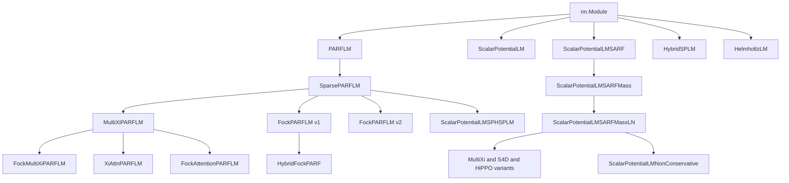
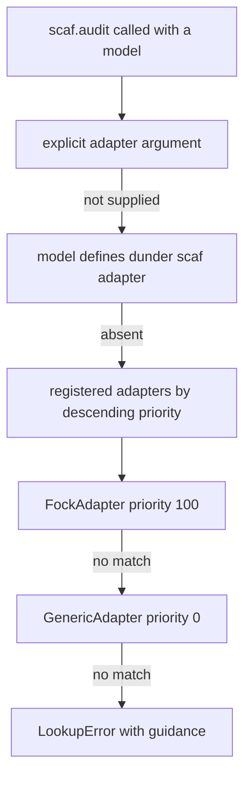

# How SCAF Interfaces with the SemSimula Model Family

**Status:** accepted, implemented in `src/scaf/core/adapters/`.
**Date:** 24 July 2026.
**Companion:** `semsimula-paper/companion_notes/Framework_for_Causal_Analysis_SemSimula_Models.md`
(the framework design), `Fock-PARFLM_Causal_Leak_Audit_Results.md` (the case study).

---

## 1. The question

SCAF must audit *any* SemSimula model for causal leaks. The family is an
inheritance tree of 25+ model classes that keeps growing, and every new node
adds an architectural knob that is a fresh leak surface. So:

> Do we need to impose a generic interface — a base class or protocol — that
> all SemSimula models implement, so SCAF can drive them uniformly?

**Answer: no.** SCAF uses an external **adapter layer resolved by structural
(duck) typing**. Models are not modified, do not inherit from anything, and do
not import SCAF. This document records why, what the adapter contract is, and
how to add support for a new family member.

---

## 2. Evidence: what a survey of the family actually found

The decision is driven by measurements, not taste. A full inventory of
`notebooks/conservative_arch/` produced the following.

### 2.1 The family is a wide tree with two distinct integrator lineages



Two lineages matter for interfacing: the **PARF** line integrates with velocity
Verlet and exposes `_stack_forward` plus `_layer_step`; the **SPLM** line uses a
damped Euler `integrate()` and has neither method. Any base class would have to
straddle both.

### 2.2 The forward contract is already not uniform

| Family | `forward` signature | Return arity |
|---|---|---|
| `PARFLM` and descendants | `(x, targets=None, return_trajectory=False, position_offset=0)` | 2 or 3 |
| `HybridFockPARF`, `HybridSPLM`, `HelmholtzLM` | `(x, targets=None, return_trajectory=False, kv_caches=None, position_offset=0)` | 2, 3 or 4 |
| SPLM line | `(x, targets=None, return_trajectory=False, return_xi_trajectory=False)` | 2, 3 or 4 |
| `ScalarPotentialLMNonConservative` | as SPLM plus `return_g_norms=False` | up to 5 |

A single abstract signature would either be so loose it guarantees nothing, or
would require touching every model to conform.

### 2.3 Internal structure diverges completely

The leak carrier is a different submodule in every branch, so there is no
common name to standardise on:

| Submodule | Present in | Causal role |
|---|---|---|
| `reverse_ch`, `reverse_channel_scale` | Fock v2, Fock-MultiXi | non-conservative register to token force; **carrier of the known leak** |
| `exchange_force`, `exchange_scale` | `FockAttentionPARFLM` | non-conservative token exchange |
| `skew_kernel`, `gyro_kernel` | `ScalarPotentialLMSPHSPLM` | non-conservative C-block forces |
| `nonconservative` | `ScalarPotentialLMNonConservative` | per-token non-conservative augmentation |
| `V_attn` | `XiAttnPARFLM` | conservative attention potential |
| `xi_module` | MultiXi PARF and SPLM | K-channel causal EMA context |
| `creation_gate` / `creation_gate_qkv` / `creation_gates` | Fock v1 and v2 | register creation; note three different names |
| `attn_blocks` | Hybrid, Helmholtz, HybridFock | causal attention front end |

Even *within* the Fock branch the creation gate has three different attribute
names depending on version.

### 2.4 One property genuinely is family-wide

Conservative-force models compute

$$
F = -\nabla_{\xi} V_{\theta}
$$

with `torch.autograd.grad` **inside** the forward pass. The gradient is part of
the physics, not part of training. Consequently:

> A SemSimula forward pass cannot run under `torch.no_grad()`.

This single fact has caused repeated production incidents. `eval_ppl_proper.py`
works around it with a mutable `use_no_grad_flag` list passed into
`_forward_logits`; the training scripts work around it with an explicit
`with torch.enable_grad():` nested inside a `@torch.no_grad()` evaluate
function — which in turn caused a CUDA OOM, because the resulting graph is
never freed by a `.backward()` call.

This is the one thing SCAF *does* standardise, and it does so in the adapter
rather than in the models.

---

## 3. The decision

> SCAF wraps models in **adapters** discovered by structural typing. Models are
> never modified and never import SCAF.

### 3.1 Four reasons

**R1 — The dependency direction forbids a base class.**
`semsimula-paper/pyproject.toml` states explicitly:

> No build backend is declared because this repository is a collection of
> research scripts, not an installable package.

SCAF therefore cannot `import` the model classes, cannot `isinstance` them, and
cannot ask them to inherit from anything SCAF defines. Adapters must detect
models by attribute probing and class-name strings. This is a hard constraint,
not a preference.

**R2 — The contract is already too varied to abstract cheaply.**
See §2.2 and §2.3. An ABC wide enough to fit `MatchedGPT`, `HelmholtzLM` and
`FockMultiXiPARFLM` would assert almost nothing.

**R3 — Retrofitting 25+ classes is disproportionate and invasive.**
It would make every model file depend on the auditor, and would have to be
repeated for each new family member — reintroducing exactly the per-model
manual work the framework exists to remove.

**R4 — An adapter is epistemically better than a base class.**
This is the decisive argument. The adapter declares `declared_sources()`: the
set of nodes each `(layer, position)` node is *intended* to depend on. That is
$G_{\text{spec}}$, the specification graph. SCAF's whole job is to diff it
against $G_{\text{impl}}$, what the code actually does:

$$
\text{leak} \iff \exists s \gt t : \quad \frac{\partial L_t}{\partial x_s} \neq 0 .
$$

If the model supplied its own $G_{\text{spec}}$, it would be marking its own
homework. Keeping the declaration **outside** the model, written by the auditor,
preserves the independence that makes the audit meaningful. The Fock leak is the
proof: the model's code asserted causality through mask geometry, and that
assertion was wrong for 100k+ training steps.

### 3.2 What this buys

| Property | Consequence |
|---|---|
| Zero model changes | No PR against `semsimula-paper` to start auditing |
| Zero import of SemSimula | SCAF installs and its tests pass with no research repo present |
| No circular dependency | `semsimula-paper` may depend on `semsimula-scaf`, never the reverse |
| Independent `G_spec` | The audit is adversarial to the implementation, as it must be |
| Graceful degradation | An unknown model still gets token-level probes via the generic adapter |

---

## 4. The adapter contract

Defined in `src/scaf/core/adapters/base.py`.

```python
class ModelAdapter(ABC):
    name: str = "abstract"
    priority: int = 0

    @classmethod
    @abstractmethod
    def detect(cls, model: nn.Module) -> bool: ...

    @abstractmethod
    def capabilities(self, model: nn.Module) -> Capabilities: ...

    def config(self, model) -> dict[str, Any]: ...
    def forward_logits(self, model, x) -> torch.Tensor: ...
    def deterministic(self, model) -> ContextManager[None]: ...
    def intervention_points(self, model) -> Iterable[tuple[str, nn.Module]]: ...
    def parameter_interventions(self, model) -> Iterable[tuple[str, nn.Parameter]]: ...
    def declared_sources(self, layer, t, T) -> Iterable[PositionalNode]: ...
```

Only `detect` and `capabilities` are abstract. Everything else has a working
default, so a minimal new adapter is about ten lines.

### 4.1 `forward_logits` — the one standardised behaviour

The base implementation encodes both hard-won lessons from §2.4:

```python
def forward_logits(self, model, x):
    with torch.enable_grad():        # physics needs autograd.grad; no_grad raises
        out = model(x)
    logits = out[0] if isinstance(out, (tuple, list)) else out
    return logits.detach()           # free the graph now, do not accumulate
```

`torch.enable_grad()` overrides any ambient `no_grad` from the caller, so probe
code can be written naturally. `detach()` releases the graph immediately, which
is precisely the fix that resolved the evaluation OOM in the training scripts.
Return-arity polymorphism is absorbed by always taking element 0.

### 4.2 `Capabilities` — negotiated, not assumed

```python
@dataclass(frozen=True)
class Capabilities:
    requires_grad_forward: bool = True
    supports_float64: bool = True
    has_registers: bool = False
    has_reverse_channel: bool = False
    has_attention: bool = False
    mediators: tuple[str, ...] = ()
    causal_flags: Mapping[str, Any] = ...
    notes: tuple[str, ...] = ()
```

Probes consult this to decide what applies. The rule is that an inapplicable
probe **skips loudly** and is recorded as skipped in the scorecard. It must
never return zero, because a probe that silently reports zero because it never
ran is the "false all-clear" that axiom A7 exists to prevent.

`causal_flags` snapshots the causality-relevant config verbatim, so an audit
record states which guarantees the model *claimed* at audit time. When a Fock
config lacks `prefix_causal_registers` entirely, the adapter emits a note that
the checkpoint predates the fix.

### 4.3 `declared_sources` — the specification graph

The default is the strict autoregressive triangle:

```python
def declared_sources(self, layer, t, T):
    if layer == 0:
        return [("x", s) for s in range(t + 1)]
    return [(layer - 1, s) for s in range(t + 1)]
```

Any edge whose source position exceeds its target position is a candidate leak.
Adapters override this only when a family legitimately deviates.

---

## 5. Resolution order



1. **Explicit** `adapter=` always wins. Full manual override.
2. **`__scaf_adapter__()`** on the model, if defined. This is the opt-in escape
   hatch: a model *may* describe itself if duck typing ever guesses wrong.
   Nothing is required to implement it, and nothing in `semsimula-paper` does.
3. **Registered adapters**, highest `priority` first, first `detect()` to return
   True wins. A detector that raises is skipped rather than being allowed to
   block the remaining adapters.

The generic adapter matches any `nn.Module`, so resolution effectively cannot
fail.

### 5.1 Detection is structural

```python
class FockAdapter(ModelAdapter):
    name = "fock"
    priority = 100

    @classmethod
    def detect(cls, model):
        has_registers = _first_attr(model, ("register_embed",)) is not None
        has_creation = _first_attr(
            model, ("creation_gate", "creation_gate_qkv", "creation_gates")
        ) is not None
        if has_registers and has_creation:
            return True
        return "fock" in type(model).__name__.lower() and has_registers
```

Note it probes all three historical creation-gate names (§2.3) and falls back to
the class name. No import, no `isinstance`.

---

## 6. The intervention surface

`InterventableModel` turns the resolved adapter into a manipulable SCM with
three do-operations:

| Mechanism | Method | Use |
|---|---|---|
| Module output edit via forward hook | `im.do(reverse_ch=zero_out)` | knock out or perturb a submodule's output |
| Parameter clamp | `im.clamp(reverse_channel_scale=0.0)` | cleaner for scalar gates |
| Mechanism-agnostic knockout | `im.knockout("reverse_channel_scale")` | prefers clamp, falls back to hook |

`knockout` is what mediation analysis uses, so a probe can name a mediator
without knowing how it is realised in that family.

An unknown name raises `KeyError` rather than being ignored. This matters more
than it looks: a silently-ignored knockout would make a leaky model score clean.

```python
with im.knockout("reverse_channel_scale"):
    cde = future_perturbation.run(im, corpus)
```

Comparing the total effect against `cde` gives the controlled direct effect and
attributes the leak to a component — the formal version of
`fock_leak_decompose.py`.

---

## 7. Worked example: auditing from a notebook

The target usage, with `semsimula-scaf` installed as a dependency of the
research repo:

```python
# In a notebook that has already built a SemSimula model.
import scaf

report = scaf.audit(
    model,                       # adapter auto-detected
    corpus=val_tokens,           # np.ndarray of validation token ids
    context=512,
    dtype="float64",             # bit-exact determinism baseline, axiom A6
)
print(report)
report.to_json("audit_step103500.json")
assert report.passed(), "causal leak detected"
```

And inside a training loop, using the cheap proxy rather than the full battery:

```python
monitor = scaf.LeakMonitor(model, corpus=val_tokens, interval=20_000)
...
if (record := monitor.maybe_run(step)) is not None:
    log_f.write(json.dumps(record) + "\n")
```

Neither snippet mentions an adapter, a hook, or a model family. That is the
point of the layer.

---

## 8. Adding an adapter for a new family member

1. Subclass `ModelAdapter` in `src/scaf/core/adapters/`.
2. Implement `detect()` structurally, and give it a `priority` above the
   generic adapter's 0 but distinct from siblings.
3. Implement `capabilities()`, listing the family's non-conservative components
   in `mediators`, most-suspect first.
4. Override `intervention_points` and `parameter_interventions` to expose those
   components.
5. Override `declared_sources` only if the family legitimately deviates from
   the strict autoregressive triangle.
6. Override `forward_logits` only if the model needs extra positional arguments.
7. Register it with `scaf.register_adapter(MyAdapter)`.
8. Add a regression case asserting the adapter is selected and that a
   deliberately-leaky configuration is caught.

Adapters may live outside SCAF; `register_adapter` is public, so a downstream
repo can ship its own without a SCAF release.

---

## 9. Alternatives considered and rejected

| Alternative | Why rejected |
|---|---|
| Base class `SemSimulaModel` that all models inherit | Violates R1 (SCAF cannot be imported by a non-package), R3 (25+ classes), and R4 (model marks its own homework) |
| `typing.Protocol` with `@runtime_checkable` | Only checks method *names*, not signatures, so it would pass for models whose `forward` takes incompatible arguments — false confidence, and still fails R4 |
| Monkey-patching models at import time | Invisible action at a distance; breaks under `torch.compile` and checkpoint round-trips |
| Requiring models to be exported to ONNX or FX-traced | The forward contains `autograd.grad`, data-dependent Gumbel top-k routing, and Python control flow over the register lifecycle; tracing loses exactly the dynamics under audit |
| Auditing at the checkpoint level only, no live model | Cannot intervene on internals, so mediation and attribution become impossible |

---

## 10. Consequences and open items

**Accepted consequences.**

- The generic adapter's mediator list is heuristic, so component attribution on
  an unknown family is best-effort. The scorecard says so explicitly.
- Adapter authors can declare a `G_spec` that is wrong. This is mitigated, not
  eliminated, by empirical discovery (`scaf.graph.discover`), which recovers
  $G_{\text{impl}}$ from perturbation-response data and cross-checks the
  declaration.
- Detection by attribute name is brittle if a family renames a submodule. Every
  adapter therefore probes a tuple of historical names, and the regression suite
  pins the expected adapter per model class.

**Open items.**

- Adapters for the SPLM line, SPHSPLM, Helmholtz and the hybrids. The generic
  adapter covers them for token-level probes today; dedicated adapters are
  needed for attribution, since each has a different non-conservative component
  (§2.3).
- `declared_sources` for families whose intended graph is not the plain
  triangle, notably the S/C and S/A block schedules.

---

## Appendix — glossary

- **$G_{\text{spec}}$** — the intended causal graph, declared by the adapter.
- **$G_{\text{impl}}$** — the causal graph the code actually realises.
- **Adapter** — family-specific plug telling SCAF where a model's intervention
  points and leak-free forward live.
- **Mediator** — a named component that can be knocked out to test whether it
  carries the leak.
- **Capability negotiation** — the adapter declaring what a model supports so
  probes skip loudly rather than silently passing.
